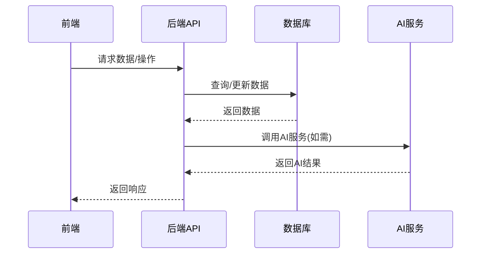
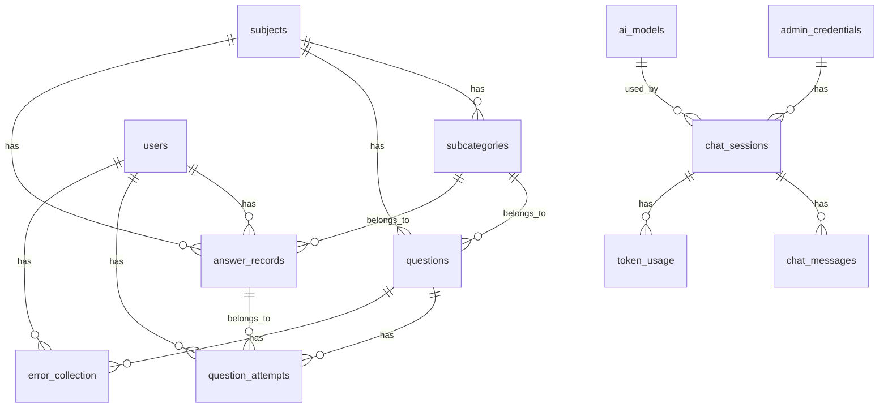

# PSCG 智能题库系统 - Code Wiki

## 1. 项目概述

PSCG (Primary School Comprehensive Quiz) 是一个基于现代Web技术构建的智能题库系统，为学生提供个性化学习体验，为教师提供高效教学管理工具。

### 1.1 项目定位
- 面向小学教育的智能题库系统
- 提供学生答题、教师管理、数据分析等功能
- 集成AI技术，提供智能分析和辅助功能

### 1.2 技术栈

| 分类 | 技术 | 版本 | 用途 |
|------|------|------|------|
| **前端** | Vue 3 + Composition API | ^3.5.25 | 前端框架 |
| | Element Plus | ^2.13.3 | UI组件库 |
| | Pinia | ^3.0.4 | 状态管理 |
| | Vue Router | ^4.6.4 | 路由管理 |
| | VisActor (VChart, VMind) | ^2.0.20, ^2.0.10 | 数据可视化 |
| | Vite | ^5.2.0 | 构建工具 |
| **后端** | Node.js | 16+ | 运行环境 |
| | Express.js | ^4.18.2 | Web框架 |
| | MySQL | 8.0 | 数据库 |
| | PM2 | - | 进程管理 |
| **依赖库** | axios | ^1.13.6 | HTTP客户端 |
| | jsonwebtoken | ^9.0.3 | JWT认证 |
| | multer | ^2.1.1 | 文件上传 |
| | mysql2 | ^3.20.0 | MySQL客户端 |
| | openai | ^4.0.0 | AI接口 |
| | quill | ^2.0.3 | 富文本编辑器 |
| | sharp | ^0.34.5 | 图像处理 |
| | xlsx | ^0.18.5 | Excel处理 |
| | zod | ^4.3.6 | 数据验证 |

## 2. 项目架构

### 2.1 系统架构

PSCG采用典型的前后端分离架构，具体如下：



### 2.2 目录结构

```
PSCG/
├── src/              # 前端源码
│   ├── views/        # 页面组件
│   ├── components/   # 组件
│   ├── stores/       # 状态管理
│   ├── utils/        # 工具函数
│   ├── router/       # 路由配置
│   ├── styles/       # 样式文件
│   ├── composables/  # 组合式API
│   └── config/       # 前端配置
├── routes/           # 后端路由
├── services/         # 后端服务
├── middleware/       # 中间件
├── config/           # 配置文件
├── utils/            # 工具函数
├── scripts/          # 脚本文件
├── public/           # 静态资源
├── audio/            # 音频文件
├── images/           # 图片文件
├── DOCS/             # 项目文档
├── server.cjs        # 后端服务器
└── package.json      # 项目配置
```

## 3. 核心模块

### 3.1 前端模块

#### 3.1.1 页面组件 (views/)

| 页面 | 路径 | 功能 |
|------|------|------|
| 登录页面 | [LoginView.vue](file:///workspace/src/views/LoginView.vue) | 用户登录 |
| 首页 | [HomeView.vue](file:///workspace/src/views/HomeView.vue) | 学科选择 |
| 子分类页面 | [SubcategoryView.vue](file:///workspace/src/views/SubcategoryView.vue) | 子分类选择 |
| 答题页面 | [QuizView.vue](file:///workspace/src/views/QuizView.vue) | 答题界面 |
| 结果页面 | [ResultView.vue](file:///workspace/src/views/ResultView.vue) | 答题结果 |
| 后台管理 | [AdminView.vue](file:///workspace/src/views/AdminView.vue) | 后台管理主页面 |
| 排行榜 | [LeaderboardView.vue](file:///workspace/src/views/LeaderboardView.vue) | 成绩排行 |
| 个人中心 | [ProfileView.vue](file:///workspace/src/views/ProfileView.vue) | 个人信息 |
| 学习进度 | [LearningProgressView.vue](file:///workspace/src/views/LearningProgressView.vue) | 学习进度分析 |
| 错题本 | [ErrorBookView.vue](file:///workspace/src/views/ErrorBookView.vue) | 错题收集 |
| 学习报告 | [LearningReportView.vue](file:///workspace/src/views/LearningReportView.vue) | 学习报告 |
| 答题历史 | [AnswerHistoryView.vue](file:///workspace/src/views/AnswerHistoryView.vue) | 答题历史记录 |
| 文档中心 | [DocsView.vue](file:///workspace/src/views/DocsView.vue) | 系统文档 |

#### 3.1.2 组件 (components/)

| 分类 | 组件 | 功能 |
|------|------|------|
| **admin/analysis** | [AnalysisCharts.vue](file:///workspace/src/components/admin/analysis/AnalysisCharts.vue) | 数据分析图表 |
| | [AnalysisOverview.vue](file:///workspace/src/components/admin/analysis/AnalysisOverview.vue) | 数据分析概览 |
| | [DataAnalysis.vue](file:///workspace/src/components/admin/analysis/DataAnalysis.vue) | 数据详细分析 |
| | [ErrorAnalysis.vue](file:///workspace/src/components/admin/analysis/ErrorAnalysis.vue) | 错误分析 |
| **admin/question-management** | [BatchAddQuestion.vue](file:///workspace/src/components/admin/question-management/BatchAddQuestion.vue) | 批量添加题目 |
| | [QuestionList.vue](file:///workspace/src/components/admin/question-management/QuestionList.vue) | 题目列表管理 |
| **admin/chat** | [ChatContainer.vue](file:///workspace/src/components/admin/chat/ChatContainer.vue) | AI聊天容器 |
| | [ChatInput.vue](file:///workspace/src/components/admin/chat/ChatInput.vue) | 聊天输入框 |
| | [MessageList.vue](file:///workspace/src/components/admin/chat/MessageList.vue) | 消息列表 |
| **quiz** | [QuestionCard.vue](file:///workspace/src/components/quiz/QuestionCard.vue) | 题目卡片 |
| | [AnswerBehaviorTracker.vue](file:///workspace/src/components/quiz/AnswerBehaviorTracker.vue) | 答题行为追踪 |
| | [ResultCard.vue](file:///workspace/src/components/quiz/ResultCard.vue) | 结果卡片 |

#### 3.1.3 路由配置

前端路由配置位于 [src/router/index.js](file:///workspace/src/router/index.js)，使用Vue Router 4实现，支持路由懒加载和错误处理。

### 3.2 后端模块

#### 3.2.1 路由 (routes/)

| 路由文件 | 路径 | 功能 |
|---------|------|------|
| [data.js](file:///workspace/routes/data.js) | /api/data | 数据管理 |
| [settings.js](file:///workspace/routes/settings.js) | /api/settings | 系统设置 |
| [subjects.js](file:///workspace/routes/subjects.js) | /api/subjects | 学科管理 |
| [questions.js](file:///workspace/routes/questions.js) | /api/questions | 题目管理 |
| [users.js](file:///workspace/routes/users.js) | /api/users | 用户管理 |
| [leaderboard.js](file:///workspace/routes/leaderboard.js) | /api/leaderboard | 排行榜 |
| [answer-records.js](file:///workspace/routes/answer-records.js) | /api/answer-records | 答题记录 |
| [quiz.js](file:///workspace/routes/quiz.js) | /api/quiz | 答题相关 |
| [analysis.js](file:///workspace/routes/analysis.js) | /api/analysis | 数据分析 |
| [difficulty.js](file:///workspace/routes/difficulty.js) | /api/difficulty | 难度管理 |
| [admin.js](file:///workspace/routes/admin.js) | /api/admin | 管理员操作 |
| [chat.js](file:///workspace/routes/chat.js) | /api/chat | AI聊天 |

#### 3.2.2 服务 (services/)

| 服务文件 | 功能 |
|---------|------|
| [database.js](file:///workspace/services/database.js) | 数据库连接和操作 |
| [cache.js](file:///workspace/services/cache.js) | 缓存服务 |
| [difficultyService.js](file:///workspace/services/difficultyService.js) | 难度调整服务 |
| [validationService.js](file:///workspace/services/validationService.js) | 数据验证服务 |
| [chat/chatService.js](file:///workspace/services/chat/chatService.js) | AI聊天服务 |
| [chat/modelManager.js](file:///workspace/services/chat/modelManager.js) | AI模型管理 |

#### 3.2.3 中间件 (middleware/)

| 中间件 | 功能 |
|--------|------|
| [adminAuth.js](file:///workspace/middleware/adminAuth.js) | 管理员权限验证 |
| [rateLimit.js](file:///workspace/middleware/rateLimit.js) | 限流保护 |
| [csrf.js](file:///workspace/middleware/csrf.js) | CSRF防护 |
| [responseTime.js](file:///workspace/middleware/responseTime.js) | 响应时间监控 |
| [dbPerformance.js](file:///workspace/middleware/dbPerformance.js) | 数据库性能监控 |
| [signatureCache.js](file:///workspace/middleware/signatureCache.js) | 签名缓存 |

## 4. 核心功能

### 4.1 后台管理

- **学科题库管理**：添加、编辑、删除学科和子分类
- **题目管理**：单个添加、批量导入题目，支持多媒体（图片、音频）
- **用户管理**：管理学生信息、年级班级
- **系统设置**：配置系统参数、AI模型

### 4.2 学生答题

- **智能出题**：根据难度和历史答题情况智能出题
- **选项随机**：每次答题选项随机排列，防止作弊
- **多媒体展示**：支持图片、音频等多媒体题目
- **实时反馈**：答题后实时显示正确答案和解析
- **错题回顾**：自动收集错题，形成错题本

### 4.3 难度调整

- **自动调整**：根据答题情况自动调整题目难度
- **时间加权**：考虑答题时间因素调整难度
- **批量调整**：支持批量调整题目难度

### 4.4 排行榜

- **全局排行**：所有学生的排名
- **个人排名**：个人在班级、年级中的排名
- **积分系统**：根据答题情况获得积分

### 4.5 数据分析

- **个人统计**：个人答题情况、正确率、知识点掌握情况
- **学科分析**：各学科答题情况分析
- **难度分布**：题目难度分布分析
- **趋势分析**：学习进度和成绩趋势分析

### 4.6 AI功能

- **智能对话**：与AI助手对话，获取学习建议
- **数据分析**：利用AI分析学习数据，提供个性化建议
- **自动总结**：自动总结学习情况和进步

## 5. 数据库结构

### 5.1 核心表结构

| 表名 | 主要字段 | 功能 |
|------|---------|------|
| **subjects** | id, name, icon_index, sort_order | 学科信息 |
| **subcategories** | id, subject_id, name, icon_index, difficulty | 子分类信息 |
| **questions** | id, subject_id, subcategory_id, content, type, options, correct_answer | 题目信息 |
| **users** | id, student_id, name, grade, class, points | 用户信息 |
| **answer_records** | id, user_id, subject_id, subcategory_id, total_questions, correct_count | 答题记录 |
| **question_attempts** | id, user_id, question_id, user_answer, correct_answer, is_correct | 题目尝试记录 |
| **error_collection** | id, user_id, question_id, correct_count | 错题收集 |
| **quiz_sessions** | id, user_id, subject_id, subcategory_id, questions, expires_at | 答题会话 |
| **admin_credentials** | id, username, password | 管理员凭证 |
| **ai_models** | id, name, provider, model_id, api_url, api_key_encrypted | AI模型配置 |
| **chat_sessions** | id, admin_id, title, model_name, total_tokens, total_cost | 聊天会话 |
| **chat_messages** | id, session_id, role, content, tokens | 聊天消息 |
| **token_usage** | id, admin_id, session_id, model_name, input_tokens, output_tokens, cost | Token使用记录 |

### 5.2 表关系



## 6. 关键类与函数

### 6.1 前端关键函数

| 函数 | 位置 | 功能 |
|------|------|------|
| `lazyLoad` | [src/router/index.js](file:///workspace/src/router/index.js) | 路由懒加载，带错误处理 |
| `app.config.errorHandler` | [src/main.js](file:///workspace/src/main.js) | 全局错误处理 |
| `router.beforeEach` | [src/router/index.js](file:///workspace/src/router/index.js) | 路由导航守卫，检查登录状态 |

### 6.2 后端关键类与函数

| 类/函数 | 位置 | 功能 |
|---------|------|------|
| `Database` | [services/database.js](file:///workspace/services/database.js) | 数据库连接和操作类 |
| `Database.connect()` | [services/database.js](file:///workspace/services/database.js) | 连接数据库 |
| `Database.initTables()` | [services/database.js](file:///workspace/services/database.js) | 初始化数据库表结构 |
| `Database.query()` | [services/database.js](file:///workspace/services/database.js) | 执行数据库查询 |
| `startServer()` | [server.cjs](file:///workspace/server.cjs) | 启动服务器 |
| `createPathTraversalGuard` | [server.cjs](file:///workspace/server.cjs) | 目录遍历防护中间件 |
| `logSecurityOperation` | [server.cjs](file:///workspace/server.cjs) | 记录安全操作日志 |

### 6.3 AI相关函数

| 函数 | 位置 | 功能 |
|------|------|------|
| `chatService` | [services/chat/chatService.js](file:///workspace/services/chat/chatService.js) | AI聊天服务 |
| `modelManager` | [services/chat/modelManager.js](file:///workspace/services/chat/modelManager.js) | AI模型管理 |
| `contextCompressor` | [services/chat/contextCompressor.js](file:///workspace/services/chat/contextCompressor.js) | 上下文压缩，优化Token使用 |

## 7. 依赖关系

### 7.1 前端依赖

| 依赖 | 用途 | 版本 |
|------|------|------|
| vue | 前端框架 | ^3.5.25 |
| vue-router | 路由管理 | ^4.6.4 |
| pinia | 状态管理 | ^3.0.4 |
| element-plus | UI组件库 | ^2.13.3 |
| @visactor/vchart | 图表库 | ^2.0.20 |
| @visactor/vmind | 智能图表 | ^2.0.10 |
| axios | HTTP客户端 | ^1.13.6 |
| quill | 富文本编辑器 | ^2.0.3 |

### 7.2 后端依赖

| 依赖 | 用途 | 版本 |
|------|------|------|
| express | Web框架 | ^4.18.2 |
| mysql2 | MySQL客户端 | ^3.20.0 |
| jsonwebtoken | JWT认证 | ^9.0.3 |
| multer | 文件上传 | ^2.1.1 |
| dotenv | 环境变量 | ^17.3.1 |
| openai | AI接口 | ^4.0.0 |
| compression | 压缩中间件 | ^1.8.1 |
| cors | 跨域中间件 | ^2.8.5 |

## 8. 项目运行

### 8.1 开发环境

```bash
# 安装依赖
npm install

# 创建必要目录
mkdir -p audio images

# 启动开发服务器
npm run dev    # 前端
npm run server # 后端
```

访问地址:
- 前端: http://localhost:5173
- 后端: http://localhost:3001
- 后台: http://localhost:5173/admin

### 8.2 生产环境

```bash
# 安装依赖
npm install

# 构建前端
npm run build

# 启动服务
node server.cjs
# 或使用PM2
pm2 start server.cjs --name "pscg-app"
pm2 save
pm2 startup
```

### 8.3 环境变量

项目使用`.env`文件配置环境变量，示例配置见`.env.example`：

```dotenv
# 服务器配置
SERVER_PORT=3001

# 数据库配置
DB_HOST=127.0.0.1
DB_PORT=3306
DB_USER=PSCG
DB_PASSWORD=xgsy@8188
DB_NAME=pscg

# AI配置
OPENAI_API_KEY=your_api_key
```

## 9. 安全措施

### 9.1 后端安全

- **限流保护**：使用rateLimit中间件限制API请求频率
- **CSRF防护**：实现CSRF token验证
- **目录遍历防护**：防止路径遍历攻击
- **SQL注入防护**：使用参数化查询
- **文件上传验证**：限制文件类型和大小
- **管理员权限验证**：adminAuth中间件验证管理员权限

### 9.2 前端安全

- **XSS防护**：使用xss-filter工具过滤用户输入
- **路由守卫**：检查用户登录状态
- **错误处理**：全局错误处理，避免暴露敏感信息

## 10. 性能优化

### 10.1 前端优化

- **路由懒加载**：减少初始加载时间
- **组件异步加载**：Element Plus组件按需加载
- **图片懒加载**：使用lazyLoad工具
- **缓存策略**：使用apiCache工具缓存API响应

### 10.2 后端优化

- **数据库连接池**：使用mysql2的连接池
- **查询优化**：添加合适的索引
- **缓存机制**：使用memory-cache缓存热点数据
- **数据库性能监控**：dbPerformance中间件监控查询性能
- **压缩中间件**：使用compression压缩响应

## 11. 错误处理

项目采用五层错误处理架构：

| 层级 | 位置 | 机制 |
|------|------|------|
| API层 | `src/utils/api.js` | 自动重试、超时、防抖、统一提示 |
| Store层 | `src/stores/*.js` | try-catch、错误状态、缓存清理 |
| 路由层 | `src/router/index.js` | 懒加载捕获、404处理、全局监听 |
| 组件层 | `defineAsyncComponent` | loading/error状态、超时处理 |
| 后端层 | `routes/*.js` | try-catch、统一JSON响应 |

## 12. 部署与维护

### 12.1 部署流程

1. 配置环境变量
2. 构建前端：`npm run build`
3. 启动服务：`pm2 start server.cjs --name "pscg-app"`
4. 保存PM2配置：`pm2 save`
5. 设置开机自启：`pm2 startup`

### 12.2 维护命令

| 命令 | 功能 |
|------|------|
| `pm2 status` | 查看服务状态 |
| `pm2 logs` | 查看服务日志 |
| `pm2 restart pscg-app` | 重启服务 |
| `npm run lint` | 代码风格检查 |
| `npm run format` | 代码格式化 |

## 13. 开发规范

### 13.1 编码规范

- 使用ESLint和Prettier进行代码风格检查和格式化
- 遵循Vue 3 Composition API最佳实践
- 后端代码使用CommonJS模块系统
- 命名规范：
  - 变量：小驼峰命名
  - 函数：小驼峰命名
  - 类：大驼峰命名
  - 常量：全大写，下划线分隔

### 13.2 目录结构规范

- 前端组件按功能模块组织
- 后端路由按功能模块组织
- 服务层封装业务逻辑
- 中间件处理横切关注点

## 14. 总结与亮点回顾

PSCG智能题库系统是一个功能完备、技术先进的教育应用，具有以下亮点：

1. **现代技术栈**：采用Vue 3、Node.js、MySQL等现代技术，确保系统性能和可维护性
2. **智能出题**：根据学生水平自动调整题目难度，提供个性化学习体验
3. **多媒体支持**：支持图片、音频等多媒体题目，丰富学习内容
4. **AI集成**：集成AI技术，提供智能分析和辅助功能
5. **完善的后台管理**：提供学科、题目、用户等全面的管理功能
6. **数据分析**：多维度分析学习数据，帮助教师和学生了解学习情况
7. **安全可靠**：多层安全防护，保障系统和数据安全
8. **性能优化**：前端和后端双重优化，确保系统响应迅速

PSCG系统不仅满足了基本的题库管理和答题功能，还通过AI技术和数据分析，为教育教学提供了更智能、更个性化的解决方案，是一个具有实际应用价值的教育科技产品。