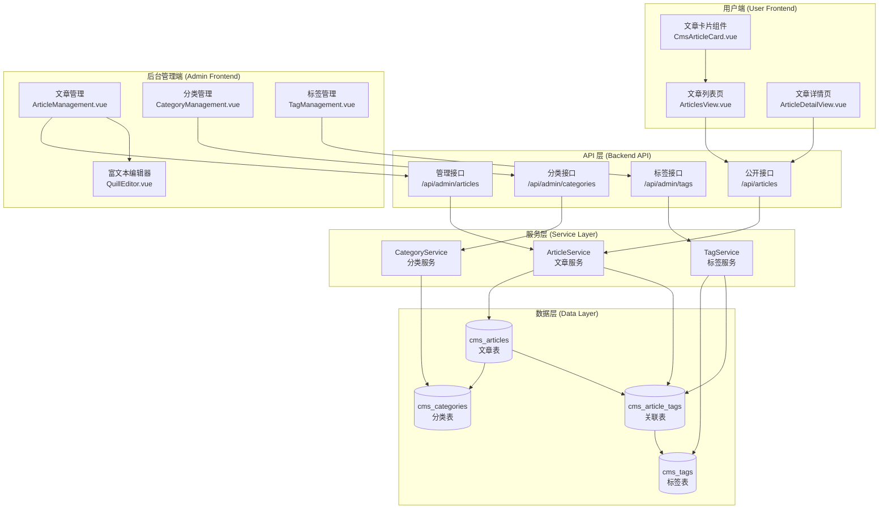
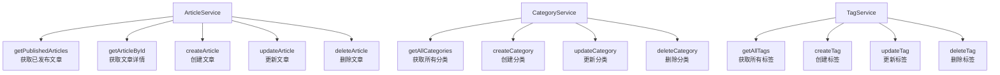
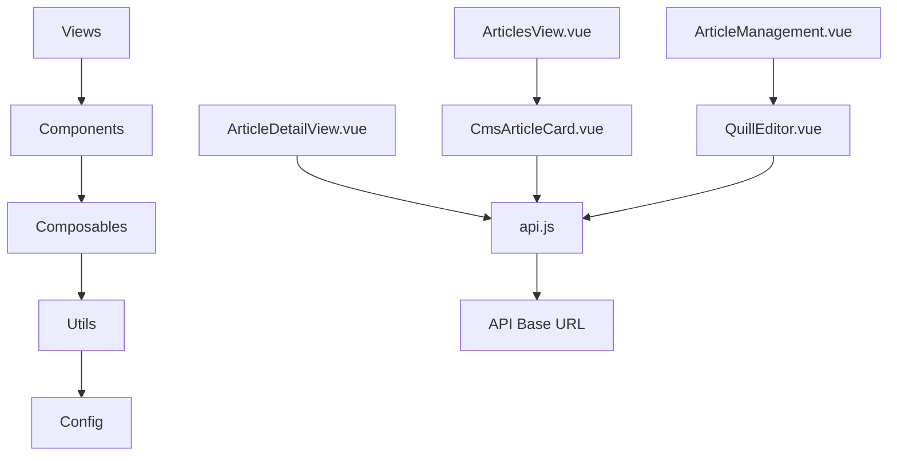
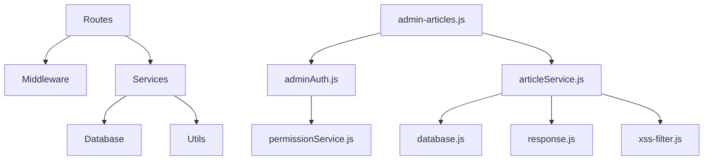
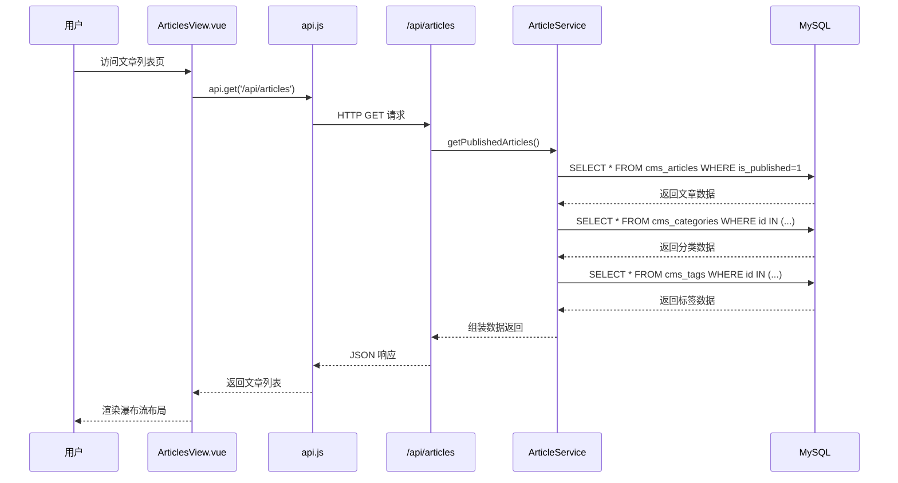
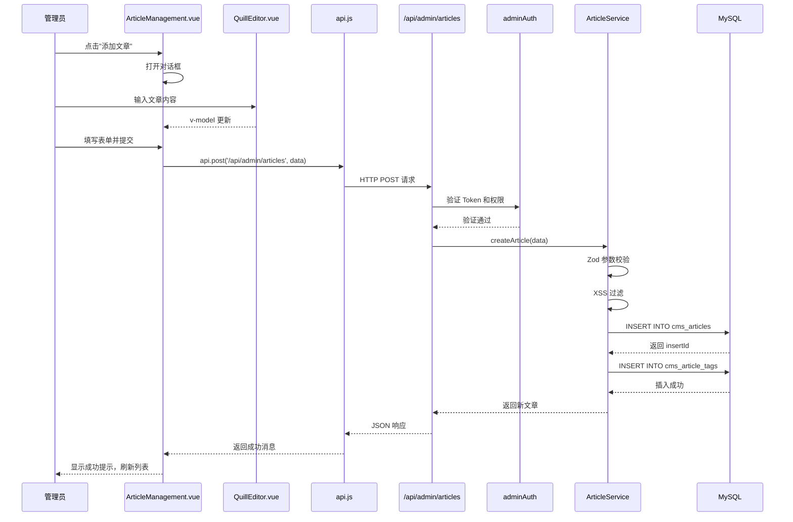
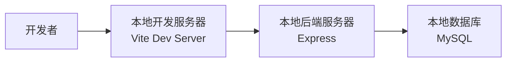
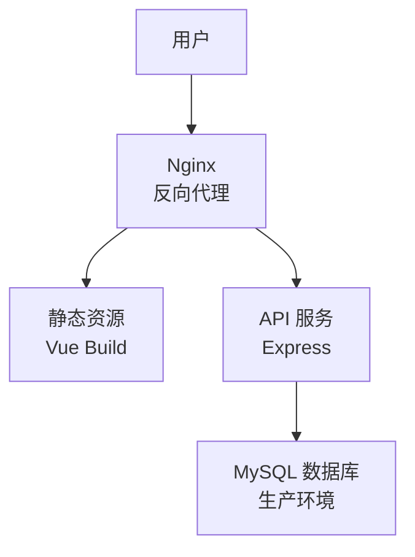

# CMS功能完善 - 架构设计文档 (DESIGN)

> 创建日期：2026-04-09
> 基于共识文档：CONSENSUS_CMS功能完善.md
> 版本：v1.0

---

## 一、整体架构图

### 1.1 系统架构概览



### 1.2 技术栈分层

| 层级 | 技术栈 | 说明 |
|------|--------|------|
| 前端展示层 | Vue 3 + Element Plus + SCSS | 用户端遵循 Figma 设计风格 |
| 前端路由层 | Vue Router | Hash 模式路由 |
| API 网关层 | Express Router | 统一入口，权限控制 |
| 业务逻辑层 | Service Classes | 业务逻辑封装 |
| 数据访问层 | MySQL2 + Connection Pool | 数据库操作 |
| 数据存储层 | MySQL 8.0 | 关系型数据库 |

---

## 二、分层设计与核心组件

### 2.1 前端分层设计

#### 2.1.1 用户端架构

```mermaid
graph LR
    A[路由层] --> B[视图层]
    B --> C[组件层]
    C --> D[工具层]
    D --> E[API层]
    
    A --> |Vue Router| A1[/articles<br/>/articles/:id]
    B --> |Views| B1[ArticlesView.vue<br/>ArticleDetailView.vue]
    C --> |Components| C1[CmsArticleCard.vue<br/>CmsContentSection.vue]
    D --> |Utils| D1[api.js<br/>message.js]
    E --> |HTTP| E1[Backend API]
```

**核心组件职责**：

| 组件 | 职责 | 数据流 |
|------|------|--------|
| ArticlesView.vue | 文章列表页容器，管理瀑布流布局 | 从 API 获取文章列表 → 传递给 CmsArticleCard |
| ArticleDetailView.vue | 文章详情页容器，渲染富文本内容 | 从 API 获取文章详情 → 渲染 HTML |
| CmsArticleCard.vue | 文章卡片组件，展示文章摘要 | 接收 article prop → 点击跳转详情页 |
| CmsContentSection.vue | 新首页文章区域（保留） | 从 API 获取最新文章 → 展示前 4 篇 |

#### 2.1.2 后台管理端架构

```mermaid
graph LR
    A[路由层] --> B[布局层]
    B --> C[管理组件层]
    C --> D[表单组件层]
    D --> E[工具层]
    E --> F[API层]
    
    A --> |Admin Router| A1[/admin]
    B --> |Layout| B1[AdminLayout.vue<br/>AdminSidebar.vue]
    C --> |Management| C1[ArticleManagement.vue<br/>CategoryManagement.vue<br/>TagManagement.vue]
    D --> |Form Components| D1[QuillEditor.vue<br/>el-form<br/>el-dialog]
    E --> |Utils| E1[api.js<br/>message.js]
    F --> |HTTP| F1[Backend API]
```

**核心组件职责**：

| 组件 | 职责 | 数据流 |
|------|------|--------|
| ArticleManagement.vue | 文章 CRUD 管理，富文本编辑 | 表格展示 → 对话框编辑 → API 提交 |
| CategoryManagement.vue | 分类 CRUD 管理 | 表格展示 → 对话框编辑 → API 提交 |
| TagManagement.vue | 标签 CRUD 管理 | 表格展示 → 对话框编辑 → API 提交 |
| QuillEditor.vue | 富文本编辑器（复用） | 双向绑定 v-model → 提交 HTML |

### 2.2 后端分层设计

#### 2.2.1 路由层 (Routes)

```mermaid
graph TB
    A[Express App] --> B[公开路由]
    A --> C[管理路由]
    
    B --> B1[/api/articles<br/>GET 列表]
    B --> B2[/api/articles/:id<br/>GET 详情]
    B --> B3[/api/categories<br/>GET 列表]
    B --> B4[/api/tags<br/>GET 列表]
    
    C --> C1[/api/admin/articles<br/>GET/POST/PUT/DELETE]
    C --> C2[/api/admin/categories<br/>GET/POST/PUT/DELETE]
    C --> C3[/api/admin/tags<br/>GET/POST/PUT/DELETE]
    C --> C4[adminAuth 中间件<br/>权限验证]
```

**路由文件结构**：

```
routes/
├── articles.js          # 公开文章路由
├── admin-articles.js    # 管理文章路由
├── admin-categories.js  # 管理分类路由
├── admin-tags.js        # 管理标签路由
└── index.js             # 路由注册入口
```

#### 2.2.2 服务层 (Services)



**服务文件结构**：

```
services/
├── articleService.js    # 文章服务
├── categoryService.js   # 分类服务
└── tagService.js        # 标签服务
```

---

## 三、模块依赖关系图

### 3.1 前端模块依赖



**依赖关系说明**：

| 模块 | 依赖项 | 说明 |
|------|--------|------|
| ArticlesView.vue | CmsArticleCard.vue, api.js | 文章列表页 |
| ArticleDetailView.vue | api.js, message.js | 文章详情页 |
| ArticleManagement.vue | QuillEditor.vue, api.js, message.js | 文章管理 |
| CategoryManagement.vue | api.js, message.js | 分类管理 |
| TagManagement.vue | api.js, message.js | 标签管理 |

### 3.2 后端模块依赖



**依赖关系说明**：

| 模块 | 依赖项 | 说明 |
|------|--------|------|
| admin-articles.js | adminAuth, articleService, response | 文章管理路由 |
| admin-categories.js | adminAuth, categoryService, response | 分类管理路由 |
| admin-tags.js | adminAuth, tagService, response | 标签管理路由 |
| articleService.js | database, xss-filter | 文章服务 |
| categoryService.js | database | 分类服务 |
| tagService.js | database | 标签服务 |

---

## 四、接口契约定义

### 4.1 公开接口契约

#### 4.1.1 获取文章列表

**请求**：
```http
GET /api/articles?page=1&pageSize=12&categoryId=1
```

**参数**：
| 参数名 | 类型 | 必填 | 说明 |
|--------|------|------|------|
| page | number | 否 | 页码，默认 1 |
| pageSize | number | 否 | 每页条数，默认 12 |
| categoryId | number | 否 | 分类ID筛选 |

**响应**：
```json
{
  "code": 200,
  "msg": "获取成功",
  "data": {
    "list": [
      {
        "id": 1,
        "title": "如何提高学习效率？",
        "summary": "科学学习方法助你事半功倍",
        "thumbnail": "/images/uploads/article-1.jpg",
        "author": "PSCG团队",
        "category": {
          "id": 1,
          "name": "学习技巧"
        },
        "tags": [
          { "id": 1, "name": "学习方法" },
          { "id": 2, "name": "时间管理" }
        ],
        "view_count": 128,
        "published_at": "2026-04-08T10:00:00.000Z"
      }
    ],
    "total": 50,
    "page": 1,
    "pageSize": 12
  }
}
```

#### 4.1.2 获取文章详情

**请求**：
```http
GET /api/articles/:id
```

**响应**：
```json
{
  "code": 200,
  "msg": "获取成功",
  "data": {
    "id": 1,
    "title": "如何提高学习效率？",
    "summary": "科学学习方法助你事半功倍",
    "content": "<p>文章内容...</p>",
    "thumbnail": "/images/uploads/article-1.jpg",
    "author": "PSCG团队",
    "category": {
      "id": 1,
      "name": "学习技巧"
    },
    "tags": [
      { "id": 1, "name": "学习方法" },
      { "id": 2, "name": "时间管理" }
    ],
    "view_count": 129,
    "published_at": "2026-04-08T10:00:00.000Z",
    "created_at": "2026-04-07T08:00:00.000Z",
    "updated_at": "2026-04-08T10:00:00.000Z"
  }
}
```

### 4.2 管理接口契约

#### 4.2.1 创建文章

**请求**：
```http
POST /api/admin/articles
Authorization: Bearer <token>
Content-Type: application/json

{
  "title": "如何提高学习效率？",
  "summary": "科学学习方法助你事半功倍",
  "content": "<p>文章内容...</p>",
  "thumbnail": "/images/uploads/article-1.jpg",
  "author": "PSCG团队",
  "category_id": 1,
  "tag_ids": [1, 2],
  "is_published": true
}
```

**参数校验（Zod）**：
```javascript
const createArticleSchema = z.object({
  title: z.string().min(1).max(200),
  summary: z.string().max(500).optional(),
  content: z.string().min(1),
  thumbnail: z.string().max(255).optional(),
  author: z.string().max(50).optional(),
  category_id: z.number().int().optional(),
  tag_ids: z.array(z.number().int()).optional(),
  is_published: z.boolean().default(false)
})
```

**响应**：
```json
{
  "code": 200,
  "msg": "创建成功",
  "data": {
    "id": 1,
    "title": "如何提高学习效率？",
    "summary": "科学学习方法助你事半功倍",
    "content": "<p>文章内容...</p>",
    "thumbnail": "/images/uploads/article-1.jpg",
    "author": "PSCG团队",
    "category_id": 1,
    "is_published": true,
    "published_at": "2026-04-08T10:00:00.000Z",
    "created_at": "2026-04-08T10:00:00.000Z"
  }
}
```

#### 4.2.2 更新文章

**请求**：
```http
PUT /api/admin/articles/:id
Authorization: Bearer <token>
Content-Type: application/json

{
  "title": "如何提高学习效率？（更新版）",
  "summary": "科学学习方法助你事半功倍",
  "content": "<p>更新后的文章内容...</p>",
  "thumbnail": "/images/uploads/article-1.jpg",
  "author": "PSCG团队",
  "category_id": 1,
  "tag_ids": [1, 2, 3],
  "is_published": true
}
```

**响应**：
```json
{
  "code": 200,
  "msg": "更新成功",
  "data": {
    "id": 1,
    "title": "如何提高学习效率？（更新版）",
    "updated_at": "2026-04-08T11:00:00.000Z"
  }
}
```

#### 4.2.3 删除文章

**请求**：
```http
DELETE /api/admin/articles/:id
Authorization: Bearer <token>
```

**响应**：
```json
{
  "code": 200,
  "msg": "删除成功",
  "data": null
}
```

---

## 五、数据流向图

### 5.1 文章列表数据流



### 5.2 文章创建数据流



---

## 六、异常处理策略

### 6.1 前端异常处理

#### 6.1.1 API 请求异常

```javascript
// src/utils/api.js
const request = async (config) => {
  try {
    const response = await axios(config)
    return response.data
  } catch (error) {
    if (error.response) {
      // 服务器返回错误
      const { status, data } = error.response
      switch (status) {
        case 400:
          showMessage(data.msg || '参数错误', 'error')
          break
        case 401:
          showMessage('未登录或登录已过期', 'error')
          router.push('/login')
          break
        case 403:
          showMessage('权限不足', 'error')
          break
        case 404:
          showMessage('资源不存在', 'error')
          break
        case 500:
          showMessage('服务器错误', 'error')
          break
        default:
          showMessage(data.msg || '请求失败', 'error')
      }
    } else if (error.request) {
      // 请求未到达服务器
      showMessage('网络错误，请检查网络连接', 'error')
    } else {
      // 其他错误
      showMessage('请求配置错误', 'error')
    }
    throw error
  }
}
```

#### 6.1.2 表单验证异常

```javascript
// ArticleManagement.vue
const handleSubmit = async () => {
  try {
    await formRef.value.validate()
    const data = { ...formData.value }
    
    // XSS 过滤
    data.content = xssFilter(data.content)
    
    if (isEditing.value) {
      await api.put(`/api/admin/articles/${currentId.value}`, data)
      showMessage('更新成功', 'success')
    } else {
      await api.post('/api/admin/articles', data)
      showMessage('创建成功', 'success')
    }
    
    dialogVisible.value = false
    fetchArticles()
  } catch (error) {
    if (error.name === 'ZodError') {
      showMessage('表单验证失败，请检查输入', 'error')
    } else {
      // API 错误已在 api.js 中处理
    }
  }
}
```

### 6.2 后端异常处理

#### 6.2.1 全局异常处理中间件

```javascript
// middleware/errorHandler.js
const errorHandler = (err, req, res, next) => {
  console.error('[错误]', err)
  
  if (err.name === 'ZodError') {
    return res.status(400).json({
      code: 400,
      msg: '参数验证失败: ' + err.errors.map(e => e.message).join(', '),
      data: null
    })
  }
  
  if (err.name === 'UnauthorizedError') {
    return res.status(401).json({
      code: 401,
      msg: '未登录或登录已过期',
      data: null
    })
  }
  
  if (err.code === 'ER_DUP_ENTRY') {
    return res.status(400).json({
      code: 400,
      msg: '数据已存在',
      data: null
    })
  }
  
  if (err.code === 'ER_NO_REFERENCED_ROW_2') {
    return res.status(400).json({
      code: 400,
      msg: '关联数据不存在',
      data: null
    })
  }
  
  res.status(500).json({
    code: 500,
    msg: process.env.NODE_ENV === 'production' ? '服务器错误' : err.message,
    data: null
  })
}

module.exports = errorHandler
```

#### 6.2.2 Service 层异常处理

```javascript
// services/articleService.js
class ArticleService {
  async createArticle(data) {
    try {
      // 参数校验
      const validatedData = createArticleSchema.parse(data)
      
      // XSS 过滤
      validatedData.title = xssFilter(validatedData.title)
      validatedData.summary = xssFilter(validatedData.summary)
      validatedData.content = xssFilter(validatedData.content)
      
      // 开启事务
      const connection = await db.pool.getConnection()
      await connection.beginTransaction()
      
      try {
        // 插入文章
        const [result] = await connection.execute(
          `INSERT INTO cms_articles (...) VALUES (...)`,
          [...]
        )
        
        // 插入标签关联
        if (validatedData.tag_ids && validatedData.tag_ids.length > 0) {
          const tagValues = validatedData.tag_ids.map(tagId => [result.insertId, tagId])
          await connection.query(
            `INSERT INTO cms_article_tags (article_id, tag_id) VALUES ?`,
            [tagValues]
          )
        }
        
        await connection.commit()
        
        // 返回新文章
        const [newArticle] = await connection.execute(
          `SELECT * FROM cms_articles WHERE id = ?`,
          [result.insertId]
        )
        
        connection.release()
        return newArticle[0]
      } catch (error) {
        await connection.rollback()
        connection.release()
        throw error
      }
    } catch (error) {
      console.error('[ArticleService] 创建文章失败:', error)
      throw error
    }
  }
}
```

### 6.3 数据库异常处理

#### 6.3.1 外键约束异常

| 异常代码 | 说明 | 处理策略 |
|----------|------|----------|
| ER_NO_REFERENCED_ROW_2 | 外键关联数据不存在 | 返回 400 错误，提示用户选择正确的分类/标签 |
| ER_ROW_IS_REFERENCED_2 | 外键被引用，无法删除 | 返回 400 错误，提示用户先删除关联文章 |
| ER_DUP_ENTRY | 唯一键冲突 | 返回 400 错误，提示用户分类/标签名称已存在 |

#### 6.3.2 SQL 注入防护

```javascript
// 使用参数化查询
const [rows] = await db.pool.execute(
  `SELECT * FROM cms_articles WHERE title LIKE ?`,
  [`%${keyword}%`]  // 参数化，防止 SQL 注入
)
```

---

## 七、性能优化策略

### 7.1 数据库优化

| 优化项 | 策略 | 说明 |
|--------|------|------|
| 索引优化 | 为高频查询字段添加索引 | `is_published`, `published_at`, `category_id` |
| 分页查询 | 使用 LIMIT + OFFSET | 避免一次性查询大量数据 |
| 连接池 | 复用数据库连接 | 减少连接创建开销 |
| 查询优化 | 避免 SELECT * | 只查询需要的字段 |

### 7.2 前端优化

| 优化项 | 策略 | 说明 |
|--------|------|------|
| 图片懒加载 | 使用 Intersection Observer | 文章封面图懒加载 |
| 路由懒加载 | 使用动态 import | 减少首屏加载时间 |
| 防抖节流 | 搜索、滚动等高频操作 | 减少不必要的请求 |
| 缓存策略 | API 缓存 | 减少重复请求 |

---

## 八、安全策略

### 8.1 XSS 防护

```javascript
// utils/xss-filter.js
const xssFilter = (html) => {
  return html
    .replace(/<script\b[^<]*(?:(?!<\/script>)<[^<]*)*<\/script>/gi, '')
    .replace(/on\w+="[^"]*"/gi, '')
    .replace(/javascript:/gi, '')
}
```

### 8.2 CSRF 防护

```javascript
// middleware/csrf.js
const csrf = require('csurf')
const csrfProtection = csrf({ cookie: true })

// 在需要 CSRF 防护的路由上使用
router.post('/api/admin/articles', csrfProtection, adminAuth, async (req, res) => {
  // ...
})
```

### 8.3 权限控制

```javascript
// middleware/adminAuth.js
const checkPermission = (module, action) => {
  return (req, res, next) => {
    try {
      if (req.admin.isSuper) return next()
      
      const hasPerm = req.admin.permissions?.[module]?.[action]
      if (!hasPerm) {
        return res.status(403).json({
          code: 403,
          msg: '权限不足',
          data: null
        })
      }
      
      next()
    } catch (err) {
      console.error('[权限验证失败]', err)
      res.status(500).json({
        code: 500,
        msg: '权限验证失败',
        data: null
      })
    }
  }
}

// 使用
router.post('/api/admin/articles', adminAuth, checkPermission('content-management', 'edit'), async (req, res) => {
  // ...
})
```

---

## 九、部署架构

### 9.1 开发环境



### 9.2 生产环境



---

## 十、下一步行动

进入 **阶段3: Atomize (原子化阶段)**，生成：
- `TASK_CMS功能完善.md` - 任务拆分文档
- 包含详细的子任务、输入输出契约、依赖关系

---

## 十一、附录

### 11.1 参考文档

- [对齐文档](./ALIGNMENT_CMS功能完善.md)
- [共识文档](./CONSENSUS_CMS功能完善.md)
- [项目规则](../.trae/rules/project_rules.md)
- [设计规范](../DESIGN.md)

### 11.2 相关代码文件

- `src/components/new-home/CmsArticleCard.vue` - 文章卡片组件
- `src/components/common/QuillEditor.vue` - 富文本编辑器
- `routes/admin-product-cards.js` - 产品卡片 API（参考）
- `services/productCardService.js` - 产品卡片服务（参考）
