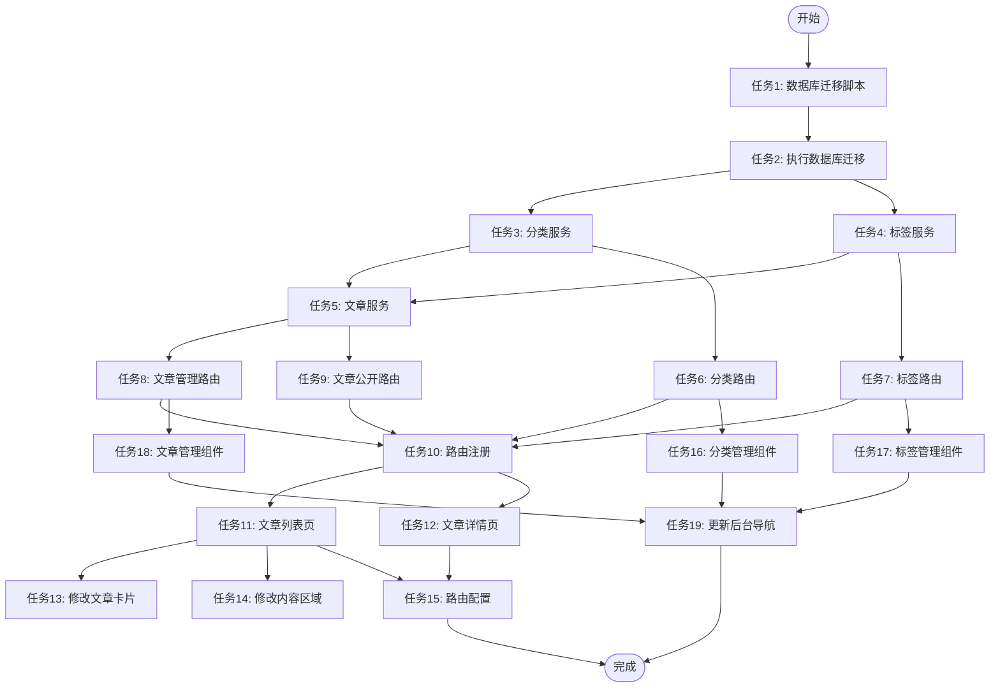

# CMS功能完善 - 任务拆分文档 (TASK)

> 创建日期：2026-04-09
> 基于架构设计：DESIGN_CMS功能完善.md
> 版本：v1.0

---

## 一、任务依赖关系图



---

## 二、原子任务清单

### 任务1: 创建数据库迁移脚本

**任务ID**: T1  
**优先级**: P0  
**预估时间**: 30分钟

#### 输入契约

| 类型 | 内容 |
|------|------|
| 前置依赖 | 无 |
| 输入数据 | 数据库设计文档（DESIGN_CMS功能完善.md） |
| 环境依赖 | MySQL 8.0+ |

#### 输出契约

| 类型 | 内容 |
|------|------|
| 输出数据 | `migrations/add-cms-tables.sql` |
| 交付物 | 数据库迁移脚本文件 |
| 验收标准 | 1. 包含 4 张表的建表语句<br>2. 包含索引和外键约束<br>3. 包含默认分类和标签数据<br>4. 包含验证脚本 |

#### 实现约束

| 类型 | 内容 |
|------|------|
| 技术栈 | SQL (MySQL 8.0 语法) |
| 接口规范 | 参照 `migrations/add-product-cards.sql` 格式 |
| 质量要求 | 1. 使用 `utf8mb4_unicode_ci` 字符集<br>2. 所有字段必须有 COMMENT<br>3. 必须包含索引优化 |

#### 依赖关系

| 类型 | 任务 |
|------|------|
| 后置任务 | T2 (执行数据库迁移) |
| 并行任务 | 无 |

---

### 任务2: 执行数据库迁移

**任务ID**: T2  
**优先级**: P0  
**预估时间**: 10分钟

#### 输入契约

| 类型 | 内容 |
|------|------|
| 前置依赖 | T1 (数据库迁移脚本) |
| 输入数据 | `migrations/add-cms-tables.sql` |
| 环境依赖 | MySQL 8.0+, 数据库连接配置 |

#### 输出契约

| 类型 | 内容 |
|------|------|
| 输出数据 | 4 张数据库表 |
| 交付物 | 数据库表结构 |
| 验收标准 | 1. 4 张表创建成功<br>2. 索引和外键约束正常<br>3. 默认数据插入成功 |

#### 实现约束

| 类型 | 内容 |
|------|------|
| 技术栈 | MySQL CLI 或 Navicat |
| 接口规范 | 使用 `source` 命令或客户端执行 SQL |
| 质量要求 | 执行前备份数据库 |

#### 依赖关系

| 类型 | 任务 |
|------|------|
| 后置任务 | T3, T4, T5 (服务层开发) |
| 并行任务 | 无 |

---

### 任务3: 创建分类服务

**任务ID**: T3  
**优先级**: P0  
**预估时间**: 45分钟

#### 输入契约

| 类型 | 内容 |
|------|------|
| 前置依赖 | T2 (数据库迁移) |
| 输入数据 | 数据库表结构, API 设计文档 |
| 环境依赖 | Node.js, Express, MySQL2 |

#### 输出契约

| 类型 | 内容 |
|------|------|
| 输出数据 | `services/categoryService.js` |
| 交付物 | 分类服务类 |
| 验收标准 | 1. 实现 CRUD 方法<br>2. 使用 Zod 参数校验<br>3. 使用数据库连接池<br>4. 错误处理完整 |

#### 实现约束

| 类型 | 内容 |
|------|------|
| 技术栈 | Node.js + Express + MySQL2 + Zod |
| 接口规范 | 参照 `services/productCardService.js` |
| 质量要求 | 1. 所有方法必须有错误处理<br>2. 使用参数化查询防止 SQL 注入 |

#### 依赖关系

| 类型 | 任务 |
|------|------|
| 后置任务 | T6 (分类路由), T16 (分类管理组件) |
| 并行任务 | T4 (标签服务) |

---

### 任务4: 创建标签服务

**任务ID**: T4  
**优先级**: P0  
**预估时间**: 45分钟

#### 输入契约

| 类型 | 内容 |
|------|------|
| 前置依赖 | T2 (数据库迁移) |
| 输入数据 | 数据库表结构, API 设计文档 |
| 环境依赖 | Node.js, Express, MySQL2 |

#### 输出契约

| 类型 | 内容 |
|------|------|
| 输出数据 | `services/tagService.js` |
| 交付物 | 标签服务类 |
| 验收标准 | 1. 实现 CRUD 方法<br>2. 使用 Zod 参数校验<br>3. 使用数据库连接池<br>4. 错误处理完整 |

#### 实现约束

| 类型 | 内容 |
|------|------|
| 技术栈 | Node.js + Express + MySQL2 + Zod |
| 接口规范 | 参照 `services/productCardService.js` |
| 质量要求 | 1. 所有方法必须有错误处理<br>2. 使用参数化查询防止 SQL 注入 |

#### 依赖关系

| 类型 | 任务 |
|------|------|
| 后置任务 | T7 (标签路由), T17 (标签管理组件) |
| 并行任务 | T3 (分类服务) |

---

### 任务5: 创建文章服务

**任务ID**: T5  
**优先级**: P0  
**预估时间**: 90分钟

#### 输入契约

| 类型 | 内容 |
|------|------|
| 前置依赖 | T2 (数据库迁移), T3 (分类服务), T4 (标签服务) |
| 输入数据 | 数据库表结构, API 设计文档 |
| 环境依赖 | Node.js, Express, MySQL2, Zod |

#### 输出契约

| 类型 | 内容 |
|------|------|
| 输出数据 | `services/articleService.js` |
| 交付物 | 文章服务类 |
| 验收标准 | 1. 实现 CRUD 方法<br>2. 实现标签关联管理<br>3. 使用事务处理<br>4. XSS 过滤<br>5. 浏览次数自增 |

#### 实现约束

| 类型 | 内容 |
|------|------|
| 技术栈 | Node.js + Express + MySQL2 + Zod |
| 接口规范 | 参照 `services/productCardService.js` |
| 质量要求 | 1. 使用事务处理文章-标签关联<br>2. 富文本内容必须 XSS 过滤<br>3. 发布时自动设置 published_at |

#### 依赖关系

| 类型 | 任务 |
|------|------|
| 后置任务 | T8 (文章管理路由), T9 (文章公开路由), T18 (文章管理组件) |
| 并行任务 | 无 |

---

### 任务6: 创建分类路由

**任务ID**: T6  
**优先级**: P0  
**预估时间**: 30分钟

#### 输入契约

| 类型 | 内容 |
|------|------|
| 前置依赖 | T3 (分类服务) |
| 输入数据 | API 设计文档 |
| 环境依赖 | Node.js, Express |

#### 输出契约

| 类型 | 内容 |
|------|------|
| 输出数据 | `routes/admin-categories.js` |
| 交付物 | 分类管理路由 |
| 验收标准 | 1. 实现 CRUD 接口<br>2. 权限验证<br>3. 统一响应格式 |

#### 实现约束

| 类型 | 内容 |
|------|------|
| 技术栈 | Node.js + Express |
| 接口规范 | 参照 `routes/admin-product-cards.js` |
| 质量要求 | 1. 使用 `adminAuth` 中间件<br>2. 使用 `checkPermission` 验证权限<br>3. 使用 `response.js` 统一响应格式 |

#### 依赖关系

| 类型 | 任务 |
|------|------|
| 后置任务 | T10 (路由注册), T16 (分类管理组件) |
| 并行任务 | T7 (标签路由) |

---

### 任务7: 创建标签路由

**任务ID**: T7  
**优先级**: P0  
**预估时间**: 30分钟

#### 输入契约

| 类型 | 内容 |
|------|------|
| 前置依赖 | T4 (标签服务) |
| 输入数据 | API 设计文档 |
| 环境依赖 | Node.js, Express |

#### 输出契约

| 类型 | 内容 |
|------|------|
| 输出数据 | `routes/admin-tags.js` |
| 交付物 | 标签管理路由 |
| 验收标准 | 1. 实现 CRUD 接口<br>2. 权限验证<br>3. 统一响应格式 |

#### 实现约束

| 类型 | 内容 |
|------|------|
| 技术栈 | Node.js + Express |
| 接口规范 | 参照 `routes/admin-product-cards.js` |
| 质量要求 | 1. 使用 `adminAuth` 中间件<br>2. 使用 `checkPermission` 验证权限<br>3. 使用 `response.js` 统一响应格式 |

#### 依赖关系

| 类型 | 任务 |
|------|------|
| 后置任务 | T10 (路由注册), T17 (标签管理组件) |
| 并行任务 | T6 (分类路由) |

---

### 任务8: 创建文章管理路由

**任务ID**: T8  
**优先级**: P0  
**预估时间**: 45分钟

#### 输入契约

| 类型 | 内容 |
|------|------|
| 前置依赖 | T5 (文章服务) |
| 输入数据 | API 设计文档 |
| 环境依赖 | Node.js, Express, multer |

#### 输出契约

| 类型 | 内容 |
|------|------|
| 输出数据 | `routes/admin-articles.js` |
| 交付物 | 文章管理路由 |
| 验收标准 | 1. 实现 CRUD 接口<br>2. 封面图上传接口<br>3. 权限验证<br>4. 统一响应格式 |

#### 实现约束

| 类型 | 内容 |
|------|------|
| 技术栈 | Node.js + Express + multer |
| 接口规范 | 参照 `routes/admin-product-cards.js` |
| 质量要求 | 1. 使用 `adminAuth` 中间件<br>2. 使用 `checkPermission` 验证权限<br>3. 图片上传限制 2MB |

#### 依赖关系

| 类型 | 任务 |
|------|------|
| 后置任务 | T10 (路由注册), T18 (文章管理组件) |
| 并行任务 | T9 (文章公开路由) |

---

### 任务9: 创建文章公开路由

**任务ID**: T9  
**优先级**: P0  
**预估时间**: 30分钟

#### 输入契约

| 类型 | 内容 |
|------|------|
| 前置依赖 | T5 (文章服务) |
| 输入数据 | API 设计文档 |
| 环境依赖 | Node.js, Express |

#### 输出契约

| 类型 | 内容 |
|------|------|
| 输出数据 | `routes/articles.js` |
| 交付物 | 文章公开路由 |
| 验收标准 | 1. 实现列表接口（分页）<br>2. 实现详情接口（浏览次数+1）<br>3. 统一响应格式 |

#### 实现约束

| 类型 | 内容 |
|------|------|
| 技术栈 | Node.js + Express |
| 接口规范 | 参照 `routes/admin-product-cards.js` 公开接口部分 |
| 质量要求 | 1. 无需权限验证<br>2. 使用 `response.js` 统一响应格式<br>3. 列表接口必须分页 |

#### 依赖关系

| 类型 | 任务 |
|------|------|
| 后置任务 | T10 (路由注册), T11 (文章列表页), T12 (文章详情页) |
| 并行任务 | T8 (文章管理路由) |

---

### 任务10: 注册路由

**任务ID**: T10  
**优先级**: P0  
**预估时间**: 10分钟

#### 输入契约

| 类型 | 内容 |
|------|------|
| 前置依赖 | T6, T7, T8, T9 (所有路由) |
| 输入数据 | 路由文件 |
| 环境依赖 | Node.js, Express |

#### 输出契约

| 类型 | 内容 |
|------|------|
| 输出数据 | 更新后的 `routes/index.js` |
| 交付物 | 路由注册代码 |
| 验收标准 | 1. 所有路由正确注册<br>2. 路由前缀正确 |

#### 实现约束

| 类型 | 内容 |
|------|------|
| 技术栈 | Node.js + Express |
| 接口规范 | 参照现有路由注册方式 |
| 质量要求 | 路由前缀：`/api/articles`, `/api/admin/articles` 等 |

#### 依赖关系

| 类型 | 任务 |
|------|------|
| 后置任务 | T11, T12, T16, T17, T18 (前端开发) |
| 并行任务 | 无 |

---

### 任务11: 创建文章列表页

**任务ID**: T11  
**优先级**: P0  
**预估时间**: 60分钟

#### 输入契约

| 类型 | 内容 |
|------|------|
| 前置依赖 | T10 (路由注册) |
| 输入数据 | API 接口, CmsArticleCard 组件 |
| 环境依赖 | Vue 3, Element Plus |

#### 输出契约

| 类型 | 内容 |
|------|------|
| 输出数据 | `src/views/ArticlesView.vue` |
| 交付物 | 文章列表页组件 |
| 验收标准 | 1. CSS Grid 瀑布流布局<br>2. 分页功能<br>3. 加载状态<br>4. 空状态提示 |

#### 实现约束

| 类型 | 内容 |
|------|------|
| 技术栈 | Vue 3 + Element Plus + SCSS |
| 接口规范 | 使用 `@/utils/api.js` |
| 质量要求 | 1. 必须使用 SCSS 变量<br>2. 遵循 Figma 设计风格<br>3. 响应式布局 |

#### 依赖关系

| 类型 | 任务 |
|------|------|
| 后置任务 | T13 (修改文章卡片), T14 (修改内容区域), T15 (路由配置) |
| 并行任务 | T12 (文章详情页) |

---

### 任务12: 创建文章详情页

**任务ID**: T12  
**优先级**: P0  
**预估时间**: 45分钟

#### 输入契约

| 类型 | 内容 |
|------|------|
| 前置依赖 | T10 (路由注册) |
| 输入数据 | API 接口 |
| 环境依赖 | Vue 3, Element Plus |

#### 输出契约

| 类型 | 内容 |
|------|------|
| 输出数据 | `src/views/ArticleDetailView.vue` |
| 交付物 | 文章详情页组件 |
| 验收标准 | 1. 富文本内容渲染<br>2. 标签展示<br>3. 返回按钮<br>4. 加载状态 |

#### 实现约束

| 类型 | 内容 |
|------|------|
| 技术栈 | Vue 3 + Element Plus + SCSS |
| 接口规范 | 使用 `@/utils/api.js` |
| 质量要求 | 1. 必须使用 SCSS 变量<br>2. 遵循 Figma 设计风格<br>3. 富文本样式正常 |

#### 依赖关系

| 类型 | 任务 |
|------|------|
| 后置任务 | T15 (路由配置) |
| 并行任务 | T11 (文章列表页) |

---

### 任务13: 修改文章卡片组件

**任务ID**: T13  
**优先级**: P0  
**预估时间**: 15分钟

#### 输入契约

| 类型 | 内容 |
|------|------|
| 前置依赖 | T11 (文章列表页) |
| 输入数据 | 现有 `CmsArticleCard.vue` |
| 环境依赖 | Vue 3 |

#### 输出契约

| 类型 | 内容 |
|------|------|
| 输出数据 | 更新后的 `CmsArticleCard.vue` |
| 交付物 | 修改后的文章卡片组件 |
| 验收标准 | 1. 点击跳转到详情页<br>2. 支持默认占位图<br>3. 样式不变 |

#### 实现约束

| 类型 | 内容 |
|------|------|
| 技术栈 | Vue 3 |
| 接口规范 | 使用 `useRouter` 跳转 |
| 质量要求 | 保持现有样式，仅修改点击事件 |

#### 依赖关系

| 类型 | 任务 |
|------|------|
| 后置任务 | 无 |
| 并行任务 | T14 (修改内容区域) |

---

### 任务14: 修改内容区域组件

**任务ID**: T14  
**优先级**: P0  
**预估时间**: 20分钟

#### 输入契约

| 类型 | 内容 |
|------|------|
| 前置依赖 | T11 (文章列表页) |
| 输入数据 | 现有 `CmsContentSection.vue` |
| 环境依赖 | Vue 3 |

#### 输出契约

| 类型 | 内容 |
|------|------|
| 输出数据 | 更新后的 `CmsContentSection.vue` |
| 交付物 | 修改后的内容区域组件 |
| 验收标准 | 1. 调用真实 API<br>2. 显示最新 4 篇文章<br>3. 点击"查看更多"跳转到列表页 |

#### 实现约束

| 类型 | 内容 |
|------|------|
| 技术栈 | Vue 3 |
| 接口规范 | 使用 `@/utils/api.js` |
| 质量要求 | 保持现有样式，仅修改数据源 |

#### 依赖关系

| 类型 | 任务 |
|------|------|
| 后置任务 | 无 |
| 并行任务 | T13 (修改文章卡片) |

---

### 任务15: 添加路由配置

**任务ID**: T15  
**优先级**: P0  
**预估时间**: 10分钟

#### 输入契约

| 类型 | 内容 |
|------|------|
| 前置依赖 | T11, T12 (文章列表页和详情页) |
| 输入数据 | 组件文件 |
| 环境依赖 | Vue Router |

#### 输出契约

| 类型 | 内容 |
|------|------|
| 输出数据 | 更新后的 `src/router/index.js` |
| 交付物 | 路由配置代码 |
| 验收标准 | 1. 路由正确配置<br>2. 路由守卫正常 |

#### 实现约束

| 类型 | 内容 |
|------|------|
| 技术栈 | Vue Router |
| 接口规范 | 参照现有路由配置 |
| 质量要求 | 使用懒加载，路由路径：`/articles`, `/articles/:id` |

#### 依赖关系

| 类型 | 任务 |
|------|------|
| 后置任务 | 无 |
| 并行任务 | 无 |

---

### 任务16: 创建分类管理组件

**任务ID**: T16  
**优先级**: P0  
**预估时间**: 60分钟

#### 输入契约

| 类型 | 内容 |
|------|------|
| 前置依赖 | T6 (分类路由) |
| 输入数据 | API 接口 |
| 环境依赖 | Vue 3, Element Plus |

#### 输出契约

| 类型 | 内容 |
|------|------|
| 输出数据 | `src/components/admin/content-management/CategoryManagement.vue` |
| 交付物 | 分类管理组件 |
| 验收标准 | 1. CRUD 功能正常<br>2. 表格展示<br>3. 对话框编辑<br>4. 表单验证 |

#### 实现约束

| 类型 | 内容 |
|------|------|
| 技术栈 | Vue 3 + Element Plus + SCSS |
| 接口规范 | 参照 `ProductCardManagement.vue` |
| 质量要求 | 1. 必须使用 SCSS 变量<br>2. 遵循后台管理风格 |

#### 依赖关系

| 类型 | 任务 |
|------|------|
| 后置任务 | T19 (更新后台导航) |
| 并行任务 | T17 (标签管理组件) |

---

### 任务17: 创建标签管理组件

**任务ID**: T17  
**优先级**: P0  
**预估时间**: 60分钟

#### 输入契约

| 类型 | 内容 |
|------|------|
| 前置依赖 | T7 (标签路由) |
| 输入数据 | API 接口 |
| 环境依赖 | Vue 3, Element Plus |

#### 输出契约

| 类型 | 内容 |
|------|------|
| 输出数据 | `src/components/admin/content-management/TagManagement.vue` |
| 交付物 | 标签管理组件 |
| 验收标准 | 1. CRUD 功能正常<br>2. 表格展示<br>3. 对话框编辑<br>4. 表单验证 |

#### 实现约束

| 类型 | 内容 |
|------|------|
| 技术栈 | Vue 3 + Element Plus + SCSS |
| 接口规范 | 参照 `ProductCardManagement.vue` |
| 质量要求 | 1. 必须使用 SCSS 变量<br>2. 遵循后台管理风格 |

#### 依赖关系

| 类型 | 任务 |
|------|------|
| 后置任务 | T19 (更新后台导航) |
| 并行任务 | T16 (分类管理组件) |

---

### 任务18: 创建文章管理组件

**任务ID**: T18  
**优先级**: P0  
**预估时间**: 90分钟

#### 输入契约

| 类型 | 内容 |
|------|------|
| 前置依赖 | T8 (文章管理路由) |
| 输入数据 | API 接口, QuillEditor 组件 |
| 环境依赖 | Vue 3, Element Plus |

#### 输出契约

| 类型 | 内容 |
|------|------|
| 输出数据 | `src/components/admin/content-management/ArticleManagement.vue` |
| 交付物 | 文章管理组件 |
| 验收标准 | 1. CRUD 功能正常<br>2. 富文本编辑器集成<br>3. 封面图上传<br>4. 分类和标签选择<br>5. 发布/草稿状态切换 |

#### 实现约束

| 类型 | 内容 |
|------|------|
| 技术栈 | Vue 3 + Element Plus + SCSS |
| 接口规范 | 参照 `ProductCardManagement.vue` |
| 质量要求 | 1. 必须使用 SCSS 变量<br>2. 遵循后台管理风格<br>3. 复用 QuillEditor 组件 |

#### 依赖关系

| 类型 | 任务 |
|------|------|
| 后置任务 | T19 (更新后台导航) |
| 并行任务 | T16, T17 (分类和标签管理组件) |

---

### 任务19: 更新后台导航菜单

**任务ID**: T19  
**优先级**: P0  
**预估时间**: 30分钟

#### 输入契约

| 类型 | 内容 |
|------|------|
| 前置依赖 | T16, T17, T18 (所有管理组件) |
| 输入数据 | 组件文件，图标资源 |
| 环境依赖 | Vue 3, Element Plus |

#### 输出契约

| 类型 | 内容 |
|------|------|
| 输出数据 | 更新后的 `AdminSidebar.vue` 和 `AdminView.vue` |
| 交付物 | 后台导航菜单配置 |
| 验收标准 | 1. 导航菜单显示"内容管理"<br>2. 子菜单：文章管理、分类管理、标签管理<br>3. 点击跳转正常<br>4. 图标显示正常 |

#### 实现约束

| 类型 | 内容 |
|------|------|
| 技术栈 | Vue 3 + Element Plus |
| 接口规范 | 参照现有导航配置 |
| 质量要求 | 保持现有导航风格 |

#### 实现步骤

**步骤1：修改 AdminSidebar.vue**

1. 导入新图标（第 85-110 行附近）：
```javascript
import {
  // ... 现有图标
  PriceTag  // 🆕 新增标签图标
} from '@element-plus/icons-vue'
```

2. 添加图标映射（第 183-202 行附近）：
```javascript
const iconMap = {
  // ... 现有映射
  PriceTag  // 🆕 新增
}
```

3. 添加菜单项（第 269-322 行附近）：
```javascript
if (isContentManagement.value) {
  const topLevelMenus = []
  
  // 导航菜单管理（已有）
  if (hasPermission('basic-settings', 'view')) {
    topLevelMenus.push({
      id: 'navigation-management',
      label: '导航菜单管理',
      icon: 'Grid',
      isMenu: true
    })
    topLevelMenus.push({
      id: 'product-card-management',
      label: '产品卡片管理',
      icon: 'Postcard',
      isMenu: true
    })
    
    // 🆕 新增 CMS 菜单
    topLevelMenus.push({
      id: 'article-management',
      label: '文章管理',
      icon: 'Document',
      isMenu: true
    })
    topLevelMenus.push({
      id: 'category-management',
      label: '分类管理',
      icon: 'FolderOpened',
      isMenu: true
    })
    topLevelMenus.push({
      id: 'tag-management',
      label: '标签管理',
      icon: 'PriceTag',
      isMenu: true
    })
  }
  
  // ... 其他代码
}
```

**步骤2：修改 AdminView.vue**

在内容管理系统视图中添加组件加载（第 9-19 行附近）：
```vue
<!-- 内容管理系统视图 -->
<template v-if="isContentManagement">
  <!-- 导航菜单管理 -->
  <NavigationManagement v-if="activeMenu === 'navigation-management'" />
  <!-- 产品卡片管理 -->
  <ProductCardManagement v-else-if="activeMenu === 'product-card-management'" />
  
  <!-- 🆕 新增 CMS 组件 -->
  <ArticleManagement v-else-if="activeMenu === 'article-management'" />
  <CategoryManagement v-else-if="activeMenu === 'category-management'" />
  <TagManagement v-else-if="activeMenu === 'tag-management'" />
  
  <!-- 角色管理 -->
  <RoleManagement v-else-if="activeMenu === 'role-management'" />
  <!-- 管理员用户 -->
  <AdminUserManagement v-else-if="activeMenu === 'admin-user-management'" />
  <!-- 默认显示导航菜单管理 -->
  <NavigationManagement v-else />
</template>
```

**步骤3：导入组件**

在 `AdminView.vue` 的 `<script setup>` 中导入新组件：
```javascript
import ArticleManagement from '@/components/admin/content-management/ArticleManagement.vue'
import CategoryManagement from '@/components/admin/content-management/CategoryManagement.vue'
import TagManagement from '@/components/admin/content-management/TagManagement.vue'
```

#### 依赖关系

| 类型 | 任务 |
|------|------|
| 后置任务 | 无 |
| 并行任务 | 无 |

#### 注意事项

1. **用户端导航**：无需修改代码，通过后台"导航菜单管理"配置
2. **后台导航**：需要修改代码，添加菜单项和组件加载逻辑
3. **图标导入**：确保 `PriceTag` 图标已正确导入和映射

---

## 三、任务执行顺序建议

### 3.1 串行任务（必须按顺序执行）

1. **数据库层**：T1 → T2
2. **服务层**：T2 → T3/T4 → T5
3. **路由层**：T3/T4/T5 → T6/T7/T8/T9 → T10

### 3.2 并行任务（可同时执行）

| 批次 | 任务 | 说明 |
|------|------|------|
| 批次1 | T3, T4 | 分类服务和标签服务可并行开发 |
| 批次2 | T6, T7 | 分类路由和标签路由可并行开发 |
| 批次3 | T8, T9 | 文章管理路由和公开路由可并行开发 |
| 批次4 | T11, T12 | 文章列表页和详情页可并行开发 |
| 批次5 | T13, T14 | 修改文章卡片和内容区域可并行开发 |
| 批次6 | T16, T17, T18 | 三个管理组件可并行开发 |

### 3.3 关键路径

```
T1 → T2 → T3/T4 → T5 → T8/T9 → T10 → T11/T12 → T15
```

**预估总时间**：约 12 小时（考虑并行开发）

---

## 四、风险评估

### 4.1 技术风险

| 风险项 | 影响 | 应对措施 |
|--------|------|----------|
| 数据库迁移失败 | 阻塞后续所有任务 | 执行前备份数据库，提供回滚脚本 |
| 富文本 XSS 攻击 | 安全漏洞 | 使用 `xss-filter.js` 过滤 |
| 外键约束冲突 | 数据插入失败 | 先插入分类和标签，再插入文章 |
| 图片上传失败 | 用户体验差 | 前端验证 + 后端验证 |

### 4.2 依赖风险

| 风险项 | 影响 | 应对措施 |
|--------|------|----------|
| 服务层未完成 | 路由层无法开发 | 严格按依赖顺序执行 |
| API 接口变更 | 前端需要修改 | 使用接口契约文档，减少变更 |

---

## 五、下一步行动

进入 **阶段4: Approve (审批阶段)**，确认：
1. 任务拆分是否完整
2. 任务依赖关系是否正确
3. 预估时间是否合理
4. 风险评估是否充分

用户确认后，进入 **阶段5: Automate (自动化执行)**。

---

## 六、附录

### 6.1 参考文档

- [对齐文档](./ALIGNMENT_CMS功能完善.md)
- [共识文档](./CONSENSUS_CMS功能完善.md)
- [架构设计](./DESIGN_CMS功能完善.md)

### 6.2 相关代码文件

- `migrations/add-product-cards.sql` - 数据库迁移脚本（参考）
- `services/productCardService.js` - 服务层（参考）
- `routes/admin-product-cards.js` - 路由层（参考）
- `src/components/admin/content-management/ProductCardManagement.vue` - 管理组件（参考）
