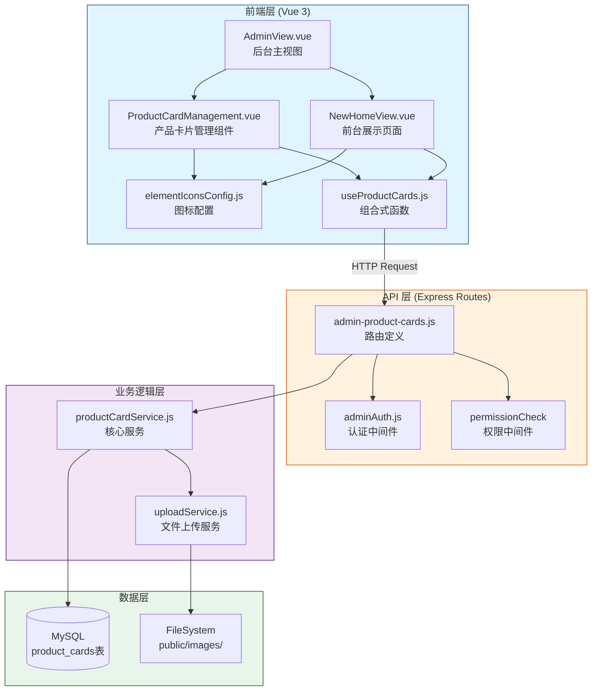
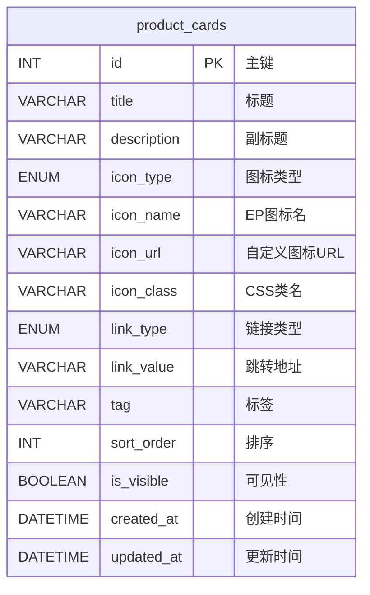

# DESIGN 文档 - 产品卡片管理功能

> 创建时间：2026-04-09 | 状态：已完成 ✅
> 基于：CONSENSUS_产品卡片管理.md

---

## 一、系统架构总览

### 1.1 整体架构图（Mermaid）



### 1.2 技术栈分层

```
┌─────────────────────────────────────────────────────────────┐
│                     表现层 (Presentation)                    │
│  Vue 3 + Element Plus + SCSS Variables                      │
│  ┌─────────────┬──────────────┬────────────────────────┐   │
│  │ Admin View   │ Home View     │ Icon Selector          │   │
│  │ (Management) │ (Display)     │ (Reusable Component)   │   │
│  └─────────────┴──────────────┴────────────────────────┘   │
├─────────────────────────────────────────────────────────────┤
│                     业务逻辑层 (Business Logic)              │
│  Composables + Services                                     │
│  ┌──────────────────┬──────────────────────────────────┐   │
│  │ useProductCards   │ productCardService               │   │
│  │ (CRUD Operations) │ (Validation & DB Operations)     │   │
│  └──────────────────┴──────────────────────────────────┘   │
├─────────────────────────────────────────────────────────────┤
│                     数据访问层 (Data Access)                 │
│  Express Routes + MySQL2 Pool                               │
│  ┌────────────────┬────────────┬────────────────────────┐  │
│  │ RESTful API    │ Middleware │ Database Pool           │  │
│  │ (CRUD Endpoints│ Auth/Perm  │ (Connection Management) │  │
│  └────────────────┴────────────┴────────────────────────┘  │
├─────────────────────────────────────────────────────────────┤
│                     基础设施层 (Infrastructure)               │
│  Node.js + Express + MySQL + File System                   │
└─────────────────────────────────────────────────────────────┘
```

---

## 二、模块详细设计

### 2.1 后端模块设计

#### 2.1.1 路由模块 (`routes/admin-product-cards.js`)

**职责**：
- 定义 RESTful API 端点
- 集成认证和权限中间件
- 请求参数预处理
- 统一错误处理

**接口清单**：

```javascript
const express = require('express')
const router = express.Router()
const adminAuth = require('../middleware/adminAuth')
const productCardService = require('../services/productCardService')
const response = require('../utils/response')
const { z } = require('zod')
const multer = require('multer')
const path = require('path')

// ============================================
// 文件上传配置
// ============================================
const storage = multer.diskStorage({
  destination: (req, file, cb) => {
    cb(null, path.join(__dirname, '../public/images/uploads'))
  },
  filename: (req, file, cb) => {
    const uniqueSuffix = Date.now() + '-' + Math.round(Math.random() * 1E9)
    const ext = path.extname(file.originalname)
    cb(null, `product-card-${uniqueSuffix}${ext}`)
  }
})

const upload = multer({
  storage,
  limits: { fileSize: 2 * 1024 * 1024 }, // 2MB
  fileFilter: (req, file, cb) => {
    const allowedTypes = ['image/png', 'image/svg+xml']
    if (allowedTypes.includes(file.mimetype)) {
      cb(null, true)
    } else {
      cb(new Error('仅支持 PNG 和 SVG 格式'))
    }
  }
})

// ============================================
// 权限检查函数（简化版）
// ============================================
function checkPermission(module, action) {
  return (req, res, next) => {
    try {
      // 超级管理员拥有所有权限
      if (req.admin.isSuper) return next()

      // TODO: 实现细粒度权限检查
      // 暂时对所有已认证管理员开放
      next()
    } catch (err) {
      console.error('权限验证失败:', err)
      response.error(res, '权限验证失败', 500)
    }
  }
}

// ============================================
// API 路由定义
// ============================================

// GET /api/product-cards - 前台获取可见卡片（无需认证）
router.get('/product-cards', async (req, res) => {
  try {
    const cards = await productCardService.getVisibleCards()
    response.success(res, cards, '获取产品卡片成功')
  } catch (err) {
    console.error('获取产品卡片失败:', err)
    response.error(res, '获取产品卡片失败')
  }
})

// GET /api/admin/product-cards - 后台获取所有卡片
router.get(
  '/admin/product-cards',
  adminAuth,
  checkPermission('content-management', 'view'),
  async (req, res) => {
    try {
      const cards = await productCardService.getAllCards()
      response.success(res, cards, '获取卡片列表成功')
    } catch (err) {
      console.error('获取卡片列表失败:', err)
      response.error(res, '获取卡片列表失败')
    }
  }
)

// POST /api/admin/product-cards - 创建卡片
router.post(
  '/admin/product-cards',
  adminAuth,
  checkPermission('content-management', 'edit'),
  async (req, res) => {
    try {
      const card = await productCardService.createCard(req.body)
      response.success(res, card, '卡片创建成功')
    } catch (err) {
      console.error('创建卡片失败:', err)
      if (err.name === 'ZodError') {
        return response.error(
          res,
          '参数验证失败: ' + err.errors.map(e => e.message).join(', '),
          400
        )
      }
      response.error(res, err.message || '创建卡片失败')
    }
  }
)

// PUT /api/admin/product-cards/:id - 更新卡片
router.put(
  '/admin/product-cards/:id',
  adminAuth,
  checkPermission('content-management', 'edit'),
  async (req, res) => {
    try {
      const id = parseInt(req.params.id)
      if (isNaN(id)) {
        return response.error(res, '无效的卡片ID', 400)
      }

      const card = await productCardService.updateCard(id, req.body)
      response.success(res, card, '卡片更新成功')
    } catch (err) {
      console.error('更新卡片失败:', err)
      if (err.message === '卡片不存在') {
        return response.error(res, '卡片不存在', 404)
      }
      if (err.name === 'ZodError') {
        return response.error(
          res,
          '参数验证失败: ' + err.errors.map(e => e.message).join(', '),
          400
        )
      }
      response.error(res, err.message || '更新卡片失败')
    }
  }
)

// DELETE /api/admin/product-cards/:id - 删除卡片
router.delete(
  '/admin/product-cards/:id',
  adminAuth,
  checkPermission('content-management', 'edit'),
  async (req, res) => {
    try {
      const id = parseInt(req.params.id)
      if (isNaN(id)) {
        return response.error(res, '无效的卡片ID', 400)
      }

      await productCardService.deleteCard(id)
      response.success(res, null, '卡片删除成功')
    } catch (err) {
      console.error('删除卡片失败:', err)
      if (err.message === '卡片不存在') {
        return response.error(res, '卡片不存在', 404)
      }
      response.error(res, err.message || '删除卡片失败')
    }
  }
)

// PUT /api/admin/product-cards/sort - 批量更新排序
router.put(
  '/admin/product-cards/sort',
  adminAuth,
  checkPermission('content-management', 'edit'),
  async (req, res) => {
    try {
      const { cards } = req.body
      if (!cards || !Array.isArray(cards)) {
        return response.error(res, 'cards 参数必须是数组', 400)
      }

      const result = await productCardService.updateSortOrder(cards)
      response.success(res, result, '排序更新成功')
    } catch (err) {
      console.error('更新排序失败:', err)
      response.error(res, '更新排序失败')
    }
  }
)

// POST /api/admin/product-cards/upload-icon - 上传图标
router.post(
  '/admin/product-cards/upload-icon',
  adminAuth,
  checkPermission('content-management', 'edit'),
  upload.single('file'),
  async (req, res) => {
    try {
      if (!req.file) {
        return response.error(res, '请选择要上传的文件', 400)
      }

      const imageUrl = `/images/uploads/${req.file.filename}`
      response.success(res, { url: imageUrl }, '图标上传成功')
    } catch (err) {
      console.error('上传图标失败:', err)
      response.error(res, err.message || '图标上传失败')
    }
  }
)

// ============================================
// ⚠️ 重要：路由路径配置说明
// ============================================
//
// 本路由文件将在 routes/index.js 中注册，格式为：
// { path: '/admin/product-cards', handler: adminProductCardsRoutes }
//
// 因此，本文件内的路径定义规则：
// - 后台管理接口：使用根路径或相对路径（避免重复 /admin/product-cards 前缀）
//   ✅ router.get('/', ...)           → 完整URL: GET /admin/product-cards
//   ✅ router.post('/', ...)          → 完整URL: POST /admin/product-cards
//   ✅ router.put('/:id', ...)        → 完整URL: PUT /admin/product-cards/:id
//   ✅ router.delete('/:id', ...)     → 完整URL: DELETE /admin/product-cards/:id
//
// - 前台接口（无需认证）：需要特殊处理！
//   方案 A（推荐）：在 server.cjs 中单独注册前台接口（不带 /admin 前缀）
//     app.use('/api/product-cards', productCardPublicRoutes)
//     → 完整URL: GET /api/product-cards
//
//   方案 B：将前台接口放在单独的路由文件中
//     创建 routes/product-cards-public.js（无需 adminAuth）
//     在 routes/index.js 中：{ path: '/product-cards', handler: publicRoutes }
//     → 完整URL: GET /api/product-cards
//
// ⚠️ 禁止的写法（会导致路径重复）：
// ❌ router.get('/product-cards', ...) + path: '/admin/product-cards'
//    → 错误结果: GET /admin/product-cards/product-cards (重复！)
//
// ============================================

module.exports = router
```

#### 2.1.2 服务模块 (`services/productCardService.js`)

**职责**：
- 封装数据库 CRUD 操作
- 数据校验（Zod Schema）
- 业务规则实现
- 初始数据迁移

**完整实现**：

```javascript
const { z } = require('zod')
const db = require('./database')

// ============================================
// Zod 校验 Schema
// ============================================

const createCardSchema = z.object({
  title: z.string().min(1).max(100),
  description: z.string().max(200).optional(),
  icon_type: z.enum(['element-plus', 'custom']),
  icon_name: z.string().max(50).optional(),
  icon_url: z.string().max(255).optional(),
  icon_class: z.string().max(50).optional(),
  link_type: z.enum(['route', 'url']),
  link_value: z.string().min(1).max(255),
  tag: z.string().max(20).optional(),
  sort_order: z.number().int().default(0),
  is_visible: z.boolean().default(true)
}).refine(data => {
  if (data.icon_type === 'element-plus' && !data.icon_name) {
    return false
  }
  if (data.icon_type === 'custom' && !data.icon_url) {
    return false
  }
  return true
}, {
  message: '根据图标类型，必须填写图标名称或图标URL'
})

const updateCardSchema = createCardSchema.partial()

// ============================================
// 默认数据定义
// ============================================

const defaultProductCards = [
  {
    title: '课程管理',
    description: '让课程管理更简单高效',
    icon_type: 'element-plus',
    icon_name: 'Reading',
    icon_class: null,
    link_type: 'route',
    link_value: '/courses',
    tag: null,
    sort_order: 1,
    is_visible: true
  },
  {
    title: '班级管理',
    description: '轻松管理班级信息',
    icon_type: 'element-plus',
    icon_name: 'UserFilled',
    icon_class: 'card-icon--purple',
    link_type: 'route',
    link_value: '/classes',
    tag: null,
    sort_order: 2,
    is_visible: true
  },
  {
    title: '数据统计',
    description: '实时查看学习数据',
    icon_type: 'element-plus',
    icon_name: 'DataAnalysis',
    icon_class: 'card-icon--pink',
    link_type: 'route',
    link_value: '/statistics',
    tag: null,
    sort_order: 3,
    is_visible: true
  },
  {
    title: 'AI 辅导',
    description: '智能辅导学习',
    icon_type: 'element-plus',
    icon_name: 'Monitor',
    icon_class: 'card-icon--green',
    link_type: 'route',
    link_value: '/ai-tutor',
    tag: 'hot',
    sort_order: 4,
    is_visible: true
  },
  {
    title: '智能推荐',
    description: '个性化学习推荐',
    icon_type: 'element-plus',
    icon_name: 'MagicStick',
    icon_class: 'card-icon--orange',
    link_type: 'route',
    link_value: '/recommendations',
    tag: null,
    sort_order: 5,
    is_visible: true
  },
  {
    title: '知识图谱',
    description: '构建知识网络',
    icon_type: 'element-plus',
    icon_name: 'Connection',
    icon_class: 'card-icon--indigo',
    link_type: 'route',
    link_value: '/knowledge-graph',
    tag: null,
    sort_order: 6,
    is_visible: true
  }
]

// ============================================
// 服务方法
// ============================================

class ProductCardService {
  /**
   * 获取所有可见的产品卡片（前台使用）
   */
  async getVisibleCards() {
    const [rows] = await db.pool.execute(`
      SELECT id, title, description, icon_type, icon_name, icon_url, icon_class,
             link_type, link_value, tag, sort_order
      FROM product_cards
      WHERE is_visible = 1
      ORDER BY sort_order ASC, id ASC
    `)
    return rows
  }

  /**
   * 获取所有产品卡片（后台管理使用）
   */
  async getAllCards() {
    const [rows] = await db.pool.execute(`
      SELECT *
      FROM product_cards
      ORDER BY sort_order ASC, id ASC
    `)
    return rows
  }

  /**
   * 创建新产品卡片
   */
  async createCard(data) {
    // Zod 校验
    const validatedData = createCardSchema.parse(data)

    const [result] = await db.pool.execute(
      `INSERT INTO product_cards SET ?`,
      [validatedData]
    )

    const [newCard] = await db.pool.execute(
      'SELECT * FROM product_cards WHERE id = ?',
      [result.insertId]
    )

    return newCard[0]
  }

  /**
   * 更新产品卡片
   */
  async updateCard(id, data) {
    // 检查卡片是否存在
    const [existing] = await db.pool.execute(
      'SELECT id FROM product_cards WHERE id = ?',
      [id]
    )

    if (existing.length === 0) {
      throw new Error('卡片不存在')
    }

    // Zod 校验（部分字段可选）
    const validatedData = updateCardSchema.parse(data)

    await db.pool.execute(
      `UPDATE product_cards SET ? WHERE id = ?`,
      [validatedData, id]
    )

    const [updatedCard] = await db.pool.execute(
      'SELECT * FROM product_cards WHERE id = ?',
      [id]
    )

    return updatedCard[0]
  }

  /**
   * 删除产品卡片
   */
  async deleteCard(id) {
    const [existing] = await db.pool.execute(
      'SELECT id FROM product_cards WHERE id = ?',
      [id]
    )

    if (existing.length === 0) {
      throw new Error('卡片不存在')
    }

    await db.pool.execute('DELETE FROM product_cards WHERE id = ?', [id])
  }

  /**
   * 批量更新排序
   */
  async updateSortOrder(cards) {
    const connection = await db.pool.getConnection()

    try {
      await connection.beginTransaction()

      for (const card of cards) {
        await connection.execute(
          'UPDATE product_cards SET sort_order = ? WHERE id = ?',
          [card.sort_order, card.id]
        )
      }

      await connection.commit()
      return { updated: cards.length }
    } catch (error) {
      await connection.rollback()
      throw error
    } finally {
      connection.release()
    }
  }

  /**
   * 初始化默认数据（仅在表为空时插入）
   */
  async initDefaultData() {
    try {
      const [countResult] = await db.pool.execute(
        'SELECT COUNT(*) as count FROM product_cards'
      )

      if (countResult[0].count === 0) {
        for (const card of defaultProductCards) {
          await db.pool.execute(
            'INSERT INTO product_cards SET ?',
            [card]
          )
        }
        console.log('✅ 已初始化默认产品卡片数据（共 6 条）')
      }
    } catch (error) {
      console.error('初始化默认产品卡片数据失败:', error)
      throw error
    }
  }
}

module.exports = new ProductCardService()
```

---

### 2.2 前端模块设计

#### 2.2.1 组合式函数 (`composables/useProductCards.js`)

**职责**：
- 封装产品卡片 CRUD 操作
- 管理加载状态
- 错误处理和消息提示

```javascript
import { ref } from 'vue'
import api from '@/utils/api'
import { showMessage } from '@/utils/message'

export function useProductCards() {
  const loading = ref(false)
  const error = ref(null)

  /**
   * 获取所有可见卡片（前台使用）
   */
  const fetchVisibleCards = async () => {
    loading.value = true
    error.value = null

    try {
      const data = await api.get('/api/product-cards')
      return Array.isArray(data) ? data : []
    } catch (err) {
      error.value = err
      console.error('[useProductCards] 获取可见卡片失败:', err)
      showMessage('加载产品卡片失败', 'error')
      return []
    } finally {
      loading.value = false
    }
  }

  /**
   * 获取所有卡片（后台管理使用）
   */
  const fetchAllCards = async () => {
    loading.value = true
    error.value = null

    try {
      const data = await api.get('/api/admin/product-cards')
      return Array.isArray(data) ? data : []
    } catch (err) {
      error.value = err
      console.error('[useProductCards] 获取卡片列表失败:', err)
      showMessage('获取卡片列表失败', 'error')
      return []
    } finally {
      loading.value = false
    }
  }

  /**
   * 创建卡片
   */
  const createCard = async (cardData) => {
    loading.value = true
    error.value = null

    try {
      const data = await api.post('/api/admin/product-cards', cardData)
      showMessage('卡片创建成功', 'success')
      return data
    } catch (err) {
      error.value = err
      console.error('[useProductCards] 创建卡片失败:', err)
      showMessage(err.message || '创建卡片失败', 'error')
      throw err
    } finally {
      loading.value = false
    }
  }

  /**
   * 更新卡片
   */
  const updateCard = async (id, cardData) => {
    loading.value = true
    error.value = null

    try {
      const data = await api.put(`/api/admin/product-cards/${id}`, cardData)
      showMessage('卡片更新成功', 'success')
      return data
    } catch (err) {
      error.value = err
      console.error('[useProductCards] 更新卡片失败:', err)
      showMessage(err.message || '更新卡片失败', 'error')
      throw err
    } finally {
      loading.value = false
    }
  }

  /**
   * 删除卡片
   */
  const deleteCard = async (id) => {
    loading.value = true
    error.value = null

    try {
      await api.delete(`/api/admin/product-cards/${id}`)
      showMessage('卡片删除成功', 'success')
    } catch (err) {
      error.value = err
      console.error('[useProductCards] 删除卡片失败:', err)
      showMessage(err.message || '删除卡片失败', 'error')
      throw err
    } finally {
      loading.value = false
    }
  }

  /**
   * 上传图标
   */
  const uploadIcon = async (file) => {
    loading.value = true
    error.value = null

    const formData = new FormData()
    formData.append('file', file)

    try {
      const data = await api.post('/api/admin/product-cards/upload-icon', formData, {
        headers: { 'Content-Type': 'multipart/form-data' }
      })
      showMessage('图标上传成功', 'success')
      return data
    } catch (err) {
      error.value = err
      console.error('[useProductCards] 上传图标失败:', err)
      showMessage(err.message || '图标上传失败', 'error')
      throw err
    } finally {
      loading.value = false
    }
  }

  return {
    loading,
    error,
    fetchVisibleCards,
    fetchAllCards,
    createCard,
    updateCard,
    deleteCard,
    uploadIcon
  }
}
```

#### 2.2.2 主组件 (`components/admin/content-management/ProductCardManagement.vue`)

**组件结构概览**：

```vue
<template>
  <div class="product-card-management">
    <!-- 页面标题 -->
    <div class="page-header">
      <h2>产品卡片管理</h2>
      <p class="description">
        管理首页展示的产品功能卡片，支持自定义图标、标题、描述和跳转链接
      </p>
    </div>

    <!-- 操作工具栏 -->
    <div class="toolbar">
      <el-button type="primary" @click="handleAdd">
        <el-icon><Plus /></el-icon>
        添加卡片
      </el-button>
      <el-button @click="fetchCards">
        <el-icon><Refresh /></el-icon>
        刷新列表
      </el-button>
    </div>

    <!-- 卡片列表表格 -->
    <el-table v-loading="loading" :data="cards" border stripe>
      <!-- 列定义... -->
    </el-table>

    <!-- 编辑对话框 -->
    <el-dialog v-model="dialogVisible" :title="isEditing ? '编辑卡片' : '添加卡片'">
      <el-form :model="formData" :rules="formRules" ref="formRef">
        <!-- 表单字段... -->
      </el-form>
    </el-dialog>
  </div>
</template>
```

**关键功能点**：
1. **图标选择器**：复用 `elementIconsConfig.js` 的 `availableIcons`
2. **图标上传**：使用 `el-upload` 组件
3. **路由/URL 选择器**：参考 NavigationManagement 的实现
4. **实时预览**：编辑时显示卡片预览效果

---

### 2.3 数据库设计详情

#### 2.3.1 ER 图（Mermaid）



#### 2.3.2 索引设计

```sql
-- 主键索引（自动创建）
PRIMARY KEY (idx)

-- 排序查询优化索引
CREATE INDEX idx_sort_order ON product_cards(sort_order);

-- 前台可见性过滤索引
CREATE INDEX idx_is_visible ON product_cards(is_visible);

-- 复合索引（常用查询：可见 + 排序）
CREATE INDEX idx_visible_sort ON product_cards(is_visible, sort_order);
```

#### 2.3.3 初始数据迁移脚本

在 `services/database.js` 的 `initTables()` 方法中添加：

```javascript
// 在 tables 数组末尾添加
{
  sql: `
    CREATE TABLE IF NOT EXISTS product_cards (
      -- （见上文完整建表语句）
    ) ENGINE=InnoDB DEFAULT CHARSET=utf8mb4 COLLATE=utf8mb4_unicode_ci
    COMMENT='产品卡片配置表';
  `,
  afterCreate: async (pool) => {
    // 初始化默认数据
    const productCardService = require('./productCardService')
    await productCardService.initDefaultData()
  }
}
```

---

## 三、接口契约定义

### 3.1 请求/响应格式规范

> **重要说明**：基于项目实际代码 `utils/response.js` 的实现

#### 统一响应结构
```typescript
interface ApiResponse<T> {
  success: boolean    // 是否成功：true=成功, false=失败
  data: T | null      // 数据载荷（成功时包含）
  message?: string    // 提示消息（可选）
}

// 错误响应格式
interface ApiError {
  success: false
  error: string       // 错误信息
}
```

**实际调用方式**：
```javascript
// 成功响应
response.success(res, data, '操作成功')
// 返回: { success: true, data: {...}, message: '操作成功' }

// 错误响应
response.error(res, '错误信息', 400)
// 返回 (HTTP 400): { success: false, error: '错误信息' }
```

#### 分页响应（预留）
```typescript
interface PaginatedResponse<T> extends ApiResponse<T[]> {
  // 可在 data 中包含分页元数据，或单独返回
  pagination?: {
    total: number       // 总记录数
    page: number        // 当前页
    pageSize: number    // 每页条数
    totalPages: number  // 总页数
  }
}
```

### 3.2 各接口详细定义

#### GET /api/product-cards
**用途**：前台获取可见产品卡片（无需认证）

**请求**：无参数

**成功响应示例** (HTTP 200)：
```json
{
  "success": true,
  "data": [
    {
      "id": 1,
      "title": "课程管理",
      "description": "让课程管理更简单高效",
      "icon_type": "element-plus",
      "icon_name": "Reading",
      "icon_url": null,
      "icon_class": null,
      "link_type": "route",
      "link_value": "/courses",
      "tag": null,
      "sort_order": 1
    },
    {
      "id": 4,
      "title": "AI 辅导",
      "description": "智能辅导学习",
      "icon_type": "element-plus",
      "icon_name": "Monitor",
      "icon_url": null,
      "icon_class": "card-icon--green",
      "link_type": "route",
      "link_value": "/ai-tutor",
      "tag": "hot",
      "sort_order": 4
    }
  ],
  "message": "获取产品卡片成功"
}
```

---

#### POST /api/admin/product-cards
**用途**：创建新产品卡片（需管理员认证）

**请求体**：
```json
{
  "title": "新功能",
  "description": "这是一个新功能卡片",
  "icon_type": "element-plus",
  "icon_name": "Star",
  "icon_class": "card-icon--blue",
  "link_type": "url",
  "link_value": "https://example.com/new-feature",
  "tag": "new",
  "sort_order": 7,
  "is_visible": true
}
```

**校验规则**：
- `title`: 必填，1-100 字符
- `description`: 可选，最长 200 字符
- `icon_type`: 必填，枚举值 ['element-plus', 'custom']
- `icon_name`: icon_type='element-plus' 时必填
- `icon_url`: icon_type='custom' 时必填
- `link_type`: 必填，枚举值 ['route', 'url']
- `link_value`: 必填，1-255 字符
- `tag`: 可选，最长 20 字符
- `sort_order`: 可选，整数，默认 0
- `is_visible`: 可选，布尔值，默认 true

**成功响应示例** (HTTP 200)：
```json
{
  "success": true,
  "data": {
    "id": 7,
    "title": "新功能",
    "description": "这是一个新功能卡片",
    "icon_type": "element-plus",
    "icon_name": "Star",
    "icon_url": null,
    "icon_class": "card-icon--blue",
    "link_type": "url",
    "link_value": "https://example.com/new-feature",
    "tag": "new",
    "sort_order": 7,
    "is_visible": 1,
    "created_at": "2026-04-09T10:30:00.000Z",
    "updated_at": "2026-04-09T10:30:00.000Z"
  },
  "message": "卡片创建成功"
}
```

**校验失败响应** (HTTP 400)：
```json
{
  "success": false,
  "error": "参数验证失败: 根据图标类型，必须填写图标名称或图标URL"
}
```

---

#### PUT /api/admin/product-cards/:id
**用途**：更新指定产品卡片（需管理员认证）

**请求参数**：
- URL 参数：`id` (INT) - 卡片 ID
- 请求体：同 POST（所有字段可选，仅提交需要更新的字段）

**成功响应示例** (HTTP 200)：同 POST（返回更新后的完整对象）

---

#### DELETE /api/admin/product-cards/:id
**用途**：删除指定产品卡片（需管理员认证）

**请求参数**：
- URL 参数：`id` (INT) - 卡片 ID

**成功响应示例** (HTTP 200)：
```json
{
  "success": true,
  "data": null,
  "message": "卡片删除成功"
}
```

---

#### POST /api/admin/product-cards/upload-icon
**用途**：上传自定义图标文件（需管理员认证）

**请求**：
- Content-Type: `multipart/form-data`
- 字段：`file` (File) - 图片文件（PNG/SVG，最大 2MB）

**成功响应示例** (HTTP 200)：
```json
{
  "success": true,
  "data": {
    "url": "/images/uploads/product-card-1744201800000-123456789.png"
  },
  "message": "图标上传成功"
}
```

---

## 四、异常处理策略

### 4.1 错误码体系

| 错误码 | HTTP 状态码 | 含义 | 处理方式 |
|--------|-------------|------|----------|
| 200 | 200 | 成功 | 正常返回数据 |
| 400 | 400 | 参数错误 | 返回具体字段错误信息 |
| 401 | 401 | 未认证 | 跳转到登录页 |
| 403 | 403 | 无权限 | 显示无权限提示 |
| 404 | 404 | 资源不存在 | 显示资源不存在提示 |
| 500 | 500 | 服务器错误 | 显示通用错误提示 + 日志记录 |

### 4.2 异常分类和处理

#### 4.2.1 参数校验异常 (ZodError)
```javascript
if (err.name === 'ZodError') {
  return response.error(
    res,
    '参数验证失败: ' + err.errors.map(e => e.message).join(', '),
    400
  )
}
```

**触发场景**：
- 必填字段缺失
- 字段长度超限
- 枚举值不匹配
- 条件校验失败（如 icon_type 与 icon_name 不匹配）

#### 4.2.2 业务逻辑异常
```javascript
if (err.message === '卡片不存在') {
  return response.error(res, '卡片不存在', 404)
}
```

**触发场景**：
- 更新/删除不存在的卡片 ID
- 排序更新时 ID 无效

#### 4.2.3 系统异常
```javascript
catch (err) {
  console.error('操作失败:', err)  // 记录详细日志
  response.error(res, '操作失败', 500)  // 返回通用错误
}
```

**触发场景**：
- 数据库连接失败
- SQL 执行错误
- 文件系统错误（上传图标时）
- 未预期的运行时错误

### 4.3 前端错误处理

```javascript
// useProductCards.js 中的统一错误处理
try {
  const data = await api.get('/api/admin/product-cards')
  return data
} catch (err) {
  // HTTP 错误状态码处理
  if (err.response?.status === 401) {
    showMessage('登录已过期，请重新登录', 'warning')
    router.push('/login')
  } else if (err.response?.status === 403) {
    showMessage('您没有权限执行此操作', 'error')
  } else {
    showMessage(err.message || '操作失败', 'error')
  }

  // 控制台输出详细错误（开发调试用）
  console.error(`[useProductCards] ${operation}失败:`, err)

  throw err  // 向上抛出，让调用者决定是否进一步处理
}
```

---

## 五、安全性设计

### 5.1 认证和授权

#### 5.1.1 接口级别权限控制
```javascript
// 所有后台接口必须通过 adminAuth 中间件
router.post('/admin/product-cards', adminAuth, ...)

// 细粒度权限检查（可后续接入）
router.post('/admin/product-cards', adminAuth, checkPermission('content-management', 'edit'), ...)
```

#### 5.1.2 权限矩阵

| 角色 | 查看 (view) | 创建 (edit) | 编辑 (edit) | 删除 (edit) | 上传图标 (edit) |
|------|------------|------------|------------|------------|----------------|
| 超级管理员 | ✅ | ✅ | ✅ | ✅ | ✅ |
| 内容管理员 | ✅ | ✅ | ✅ | ✅ | ✅ |
| 只读管理员 | ✅ | ❌ | ❌ | ❌ | ❌ |

> **当前策略**：暂时对所有已认证管理员开放全部权限（待权限系统完善后细化）

### 5.2 输入安全

#### 5.2.1 SQL 注入防护
```javascript
// ✅ 正确：使用参数化查询
await db.pool.execute(
  'INSERT INTO product_cards SET ?',
  [validatedData]
)

// ❌ 错误：字符串拼接（禁止）
await db.pool.execute(
  `INSERT INTO product_cards (title) VALUES ('${title}')`
)
```

#### 5.2.2 XSS 防护
- 标题、描述等文本字段在显示前进行 HTML 转义（Vue 自动处理）
- 自定义图标 URL 进行白名单校验（仅允许 `/images/` 开头的路径）

#### 5.2.3 文件上传安全
```javascript
const upload = multer({
  // 文件类型限制
  fileFilter: (req, file, cb) => {
    const allowedTypes = ['image/png', 'image/svg+xml']
    if (allowedTypes.includes(file.mimetype)) {
      cb(null, true)
    } else {
      cb(new Error('仅支持 PNG 和 SVG 格式'))
    }
  },
  // 文件大小限制
  limits: { fileSize: 2 * 1024 * 1024 }, // 2MB
  // 存储路径限制（防止路径遍历攻击）
  storage: {
    destination: (req, file, cb) => {
      // 固定目录，不允许用户指定
      cb(null, './public/images/uploads/')
    }
  }
})
```

### 5.3 数据安全

- **敏感操作二次确认**：删除操作使用 `el-popconfirm`
- **操作日志**：关键操作记录到控制台（生产环境可接入日志系统）
- **事务保护**：批量排序操作使用数据库事务

---

## 六、性能优化方案

### 6.1 数据库性能

#### 6.1.1 查询优化
```sql
-- 前台查询：只查必要字段 + 索引过滤
SELECT id, title, description, icon_type, icon_name, icon_url, icon_class,
       link_type, link_value, tag, sort_order
FROM product_cards
WHERE is_visible = 1  -- 使用 idx_visible_sort 索引
ORDER BY sort_order ASC, id ASC
LIMIT 100  -- 防止意外大量数据
```

#### 6.1.2 连接池复用
- 使用 `db.pool.execute()` 复用连接池连接
- 批量操作使用事务 + 单个连接

### 6.2 前端性能

#### 6.2.1 懒加载
```javascript
// ProductCardManagement.vue 使用异步组件
const ProductCardManagement = defineAsyncComponent(() =>
  import('@/components/admin/content-management/ProductCardManagement.vue')
)
```

#### 6.2.2 图标按需加载
- Element Plus 图标通过动态组件 `<component :is="iconName">` 渲染
- 自定义图标懒加载（仅在滚动到可视区域时加载）

#### 6.2.3 缓存策略（可选）
```javascript
// 前台产品卡片缓存（避免每次进入页面都请求 API）
const cardCache = ref(null)
const cacheExpiry = ref(0)
const CACHE_DURATION = 5 * 60 * 1000 // 5分钟

const fetchVisibleCards = async () => {
  if (Date.now() < cacheExpiry.value && cardCache.value) {
    return cardCache.value
  }

  const data = await api.get('/api/product-cards')
  cardCache.value = data
  cacheExpiry.value = Date.now() + CACHE_DURATION
  return data
}
```

---

## 七、测试策略

### 7.1 单元测试

#### 7.1.1 后端服务测试
```javascript
// tests/services/productCardService.test.js

describe('ProductCardService', () => {
  describe('createCard()', () => {
    it('应该成功创建有效卡片', async () => {
      const validData = {
        title: '测试卡片',
        icon_type: 'element-plus',
        icon_name: 'Reading',
        link_type: 'route',
        link_value: '/test'
      }

      const result = await productCardService.createCard(validData)

      expect(result).toHaveProperty('id')
      expect(result.title).toBe('测试卡片')
    })

    it('应该在缺少必填字段时抛出 ZodError', async () => {
      const invalidData = {
        title: '',  // 空标题
        icon_type: 'element-plus',
        // 缺少 icon_name
        link_type: 'route',
        link_value: '/test'
      }

      await expect(productCardService.createCard(invalidData))
        .rejects.toThrow('ZodError')
    })

    it('应该在 icon_type=custom 但缺少 icon_url 时拒绝', async () => {
      const invalidData = {
        title: '测试卡片',
        icon_type: 'custom',
        // 缺少 icon_url
        link_type: 'route',
        link_value: '/test'
      }

      await expect(productCardService.createCard(invalidData))
        .rejects.toThrow(/图标名称或图标URL/)
    })
  })
})
```

#### 7.1.2 前端 Composable 测试
```javascript
// tests/composables/useProductCards.test.js

describe('useProductCards', () => {
  it('fetchVisibleCards 应该返回卡片数组', async () => {
    const { fetchVisibleCards } = useProductCards()

    // Mock API 响应
    api.get.mockResolvedValue([
      { id: 1, title: '卡片1' },
      { id: 2, title: '卡片2' }
    ])

    const cards = await fetchVisibleCards()

    expect(cards).toHaveLength(2)
    expect(cards[0].title).toBe('卡片1')
  })

  it('createCard 应该在成功后显示成功消息', async () => {
    const { createCard } = useProductCards()

    api.post.mockResolvedValue({ id: 1, title: '新卡片' })

    await createCard({ title: '新卡片', ... })

    expect(showMessage).toHaveBeenCalledWith('卡片创建成功', 'success')
  })
})
```

### 7.2 集成测试

#### 7.2.1 API 集成测试
```javascript
// tests/integration/product-cards-api.test.js

describe('POST /api/admin/product-cards', () => {
  it('未认证用户应该返回 401', async () => {
    const response = await request(app)
      .post('/api/admin/product-cards')
      .send({ title: '测试' })

    expect(response.status).toBe(401)
  })

  it('应该成功创建卡片并返回 201', async () => {
    const token = await getAdminToken()

    const response = await request(app)
      .post('/api/admin/product-cards')
      .set('Authorization', `Bearer ${token}`)
      .send({
        title: '集成测试卡片',
        icon_type: 'element-plus',
        icon_name: 'Star',
        link_type: 'route',
        link_value: '/integration-test'
      })

    expect(response.status).toBe(200)
    expect(response.body.data.title).toBe('集成测试卡片')
    expect(response.body.data.id).toBeDefined()
  })
})
```

### 7.3 E2E 测试（可选）

使用 Playwright 测试完整的用户操作流程：
1. 管理员登录后台
2. 进入"产品卡片管理"页面
3. 点击"添加卡片"
4. 填写表单并提交
5. 验证卡片出现在列表中
6. 编辑刚创建的卡片
7. 删除该卡片
8. 验证卡片已从列表移除

---

## 八、部署和运维

### 8.1 数据库迁移

首次部署时自动执行：
- 在 `database.js` 的 `initTables()` 中添加建表语句
- 服务启动时检测表是否存在，不存在则创建
- 表创建后立即插入默认数据

### 8.2 文件系统要求

确保以下目录存在且可写：
```
public/
└── images/
    └── uploads/    # 自定义图标存储位置（自动创建）
```

### 8.3 配置项（可选）

可在 `.env` 文件中添加配置：
```env
# 产品卡片配置
PRODUCT_CARD_MAX_COUNT=20          # 最大卡片数量限制
PRODUCT_CARD_ICON_MAX_SIZE=2097152  # 图标最大尺寸（字节，默认 2MB）
PRODUCT_CARD_CACHE_TTL=300         # 前台缓存时间（秒，默认 5 分钟）
```

---

## 九、监控和日志

### 9.1 关键操作日志

```javascript
console.log(`[ProductCard] 操作: ${action}, 用户: ${admin.id}, 卡片ID: ${cardId}`)
```

**需记录的操作**：
- 创建卡片：`{ action: 'create', userId, cardId, title }`
- 更新卡片：`{ action: 'update', userId, cardId, changedFields }`
- 删除卡片：`{ action: 'delete', userId, cardId, title }`
- 上传图标：`{ action: 'upload-icon', userId, cardId, fileName, fileSize }`

### 9.2 性能监控指标

- API 响应时间（P50, P95, P99）
- 数据库查询耗时
- 文件上传成功率
- 错误率（按错误类型分类）

---

## 十、文档元信息

| 项目 | 内容 |
|------|------|
| **文档版本** | v1.0 |
| **创建时间** | 2026-04-09 |
| **最后更新** | 2026-04-09 |
| **作者** | 6A 工作流系统 |
| **关联文档** | CONSENSUS_产品卡片管理.md, TASK_产品卡片管理.md |
| **设计原则** | 简单、可维护、可扩展、安全 |

---

## 十一、设计决策记录 (ADR)

### ADR-001: 图标双模式存储
**决策**：支持 Element Plus 图标和自定义文件两种模式
**理由**：
- 用户明确需求
- 平衡灵活性和易用性
- 复用现有 elementIconsConfig.js 配置

### ADR-002: 初始数据自动迁移
**决策**：在 database.js 中自动插入 6 个默认卡片
**理由**：
- 降低部署复杂度
- 保证前台首访体验
- 允许后续修改或删除

### ADR-003: 权限简化策略
**决策**：暂时对所有已认证管理员开放全部权限
**理由**：
- 权限系统可能尚未完善 content-management 模块
- 降低初期开发和测试复杂度
- 可后续快速接入细粒度权限

---

**下一步行动**：进入阶段 3 (Atomize) - 任务原子化拆分
