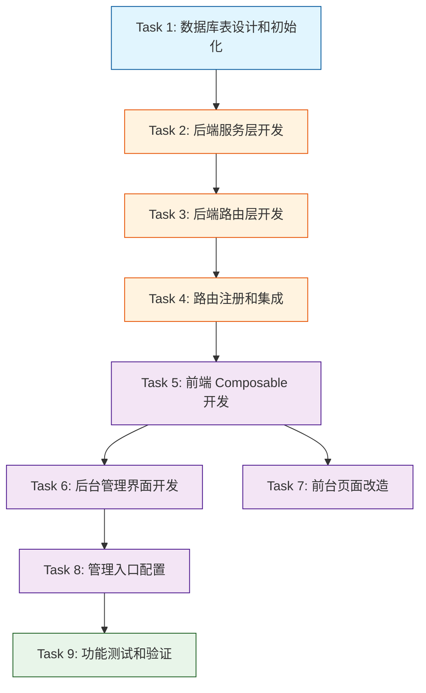

# TASK 文档 - 产品卡片管理功能

> 创建时间：2026-04-09 | 状态：待执行
> 基于：DESIGN_产品卡片管理.md

---

## 一、任务总览

### 1.1 任务依赖图（Mermaid）



### 1.2 任务统计
- **总任务数**: 9 个
- **关键路径**: Task 1 → 2 → 3 → 4 → 5 → 6 → 8 → 9
- **可并行任务**:
  - Task 6 和 Task 7 可并行（都依赖 Task 5）
- **预估总工时**: **3.5-4.5 小时**（已修正：原 2-3 小时有误）

---

## 二、原子任务详情

---

### 🔵 Task 1: 数据库表设计和初始化

#### 任务描述
在 MySQL 数据库中创建 `product_cards` 表，并编写初始数据迁移逻辑。

#### 输入契约
**前置依赖**:
- [x] MySQL 数据库服务已启动
- [x] 项目数据库连接配置正确（.env 文件）
- [x] `services/database.js` 已存在且正常工作

**输入数据**:
- 建表 SQL 语句（见 DESIGN 文档 2.3.1 节）
- 默认产品卡片数据（6 条记录，见 DESIGN 文档 2.1.2 节）

#### 输出契约
**交付物**:
- [ ] `product_cards` 表已成功创建
- [ ] 6 条默认数据已插入（仅在表为空时）
- [ ] 相关索引已创建（sort_order, is_visible, visible_sort）
- [ ] 服务重启时不会重复插入默认数据

**验收标准**:
- [ ] 执行 `SHOW TABLES LIKE 'product_cards'` 返回结果
- [ ] 执行 `SELECT COUNT(*) FROM product_cards` 返回 6
- [ ] 默认数据的 title 字段包含：课程管理、班级管理、数据统计、AI 辅导、智能推荐、知识图谱
- [ ] 再次重启服务后，数据量仍为 6（无重复）

#### 实现约束
**技术栈**: MySQL2 + Node.js
**文件位置**: `services/database.js`
**实现方式**: 在 `initTables()` 方法的 `tables` 数组中添加建表 SQL 字符串（与现有表定义保持一致）

**关键代码片段**：
```javascript
// services/database.js - initTables() 方法中的 tables 数组
const tables = [
  // ... 现有的表定义（subjects, subcategories, questions 等）...

  // ✅ 新增：产品卡片配置表（纯 SQL 字符串，与其他表格式一致）
  `CREATE TABLE IF NOT EXISTS product_cards (
    id INT PRIMARY KEY AUTO_INCREMENT,
    title VARCHAR(100) NOT NULL COMMENT '标题',
    description VARCHAR(200) DEFAULT NULL COMMENT '副标题/描述',
    icon_type ENUM('element-plus', 'custom') NOT NULL DEFAULT 'element-plus'
      COMMENT '图标类型：element-plus=内置图标, custom=自定义文件',
    icon_name VARCHAR(50) DEFAULT NULL COMMENT 'Element Plus 图标名称（如 Reading）',
    icon_url VARCHAR(255) DEFAULT NULL COMMENT '自定义图标URL路径（如 /images/custom-icon.png）',
    icon_class VARCHAR(50) DEFAULT NULL COMMENT '图标CSS类名（如 card-icon--purple）',
    link_type ENUM('route', 'url') NOT NULL DEFAULT 'route'
      COMMENT '链接类型：route=内部路由, url=外部URL',
    link_value VARCHAR(255) NOT NULL DEFAULT '/' COMMENT '跳转值（路由路径或完整URL）',
    tag VARCHAR(20) DEFAULT NULL COMMENT '标签（hot/new/recommended等）',
    sort_order INT NOT NULL DEFAULT 0 COMMENT '排序序号（越小越靠前）',
    is_visible TINYINT(1) NOT NULL DEFAULT 1 COMMENT '是否可见（1=可见, 0=隐藏）',
    created_at DATETIME DEFAULT CURRENT_TIMESTAMP COMMENT '创建时间',
    updated_at DATETIME DEFAULT CURRENT_TIMESTAMP ON UPDATE CURRENT_TIMESTAMP COMMENT '更新时间',
    INDEX idx_sort_order (sort_order),
    INDEX idx_is_visible (is_visible),
    INDEX idx_visible_sort (is_visible, sort_order)
  ) ENGINE=InnoDB DEFAULT CHARSET=utf8mb4 COLLATE=utf8mb4_unicode_ci
  COMMENT='产品卡片配置表'`
]

// 在 initTables() 最后调用默认数据初始化
for (const sql of tables) {
  await this.pool.execute(sql)
}

await this.addIndexes()

// ✅ 初始化默认产品卡片数据（仅在表为空时插入）
await this.initDefaultProductCards()
```

**依赖关系调整**：
⚠️ **重要**：Task 1 和 Task 2 需要协同实施！
- 原因：`initDefaultProductCards()` 方法需要在 `productCardService.js` 中定义
- **推荐执行顺序**：
  1. 先完成 Task 2 的基础结构（创建 service 文件 + initDefaultData 方法）
  2. 再完成 Task 1（在建表 SQL 后调用 service 的方法）

**风险点**:
- ⚠️ 如果 `productCardService.js` 尚未创建会导致 require 报错
- **缓解措施**：先创建 service 文件的基础结构，或在 database.js 中内联初始数据逻辑

**预计耗时**: 20 分钟（与 Task 2 协同实施）

---

### 🟠 Task 2: 后端服务层开发

#### 任务描述
创建 `productCardService.js`，实现所有业务逻辑和数据操作。

#### 输入契约
**前置依赖**:
- [x] Task 1 完成（表已创建）
- [x] `services/database.js` 可用
- [x] Zod 库已安装（package.json 中有 zod 依赖）

**输入数据**:
- Zod 校验 Schema 定义（见 DESIGN 文档 2.1.2 节）
- 默认产品卡片数据定义
- 数据库 CRUD 操作规范

#### 输出契约
**交付物**:
- [ ] `services/productCardService.js` 文件已创建
- [ ] 包含以下方法：
  - [ ] `getVisibleCards()` - 获取可见卡片
  - [ ] `getAllCards()` - 获取所有卡片
  - [ ] `createCard(data)` - 创建卡片（含 Zod 校验）
  - [ ] `updateCard(id, data)` - 更新卡片
  - [ ] `deleteCard(id)` - 删除卡片
  - [ ] `updateSortOrder(cards)` - 批量更新排序
  - [ ] `initDefaultData()` - 初始化默认数据
- [ ] 所有方法都有完整的错误处理
- [ ] Zod 校验规则完整覆盖所有字段

**验收标准**:
- [ ] 使用 Node.js 可以成功 require 该模块：`require('./productCardService')`
- [ ] 调用 `getVisibleCards()` 返回数组（即使为空数组）
- [ ] 调用 `createCard()` 时传入无效数据抛出 ZodError
- [ ] 调用 `updateCard(9999, {})` 抛出"卡片不存在"错误
- [ ] 调用 `deleteCard(9999)` 抛出"卡片不存在"错误
- [ ] `initDefaultData()` 在表为空时插入 6 条数据，在有数据时不插入

#### 实现约束
**技术栈**: Node.js + Zod + MySQL2
**文件位置**: `services/productCardService.js`
**代码风格**:
- 使用 Class 或 Module.exports 单例模式
- 所有 async 方法必须有 try-catch
- Zod 错误必须保留原始 name='ZodError'
- 数据库操作使用参数化查询

**关键代码结构**:
```javascript
// services/productCardService.js
const { z } = require('zod')
const db = require('./database')

// Zod Schemas
const createCardSchema = z.object({...})
const updateCardSchema = createCardSchema.partial()

// Default Data
const defaultProductCards = [...]

// Service Class
class ProductCardService {
  async getVisibleCards() {...}
  async getAllCards() {...}
  async createCard(data) {...}
  async updateCard(id, data) {...}
  async deleteCard(id) {...}
  async updateSortOrder(cards) {...}
  async initDefaultData() {...}
}

module.exports = new ProductCardService()
```

**风险点**:
- ⚠️ Zod 版本兼容性（项目使用 ^3.23.x）
- ⚠️ MySQL2 的 pool.execute() 方法签名
- **缓解措施**: 参考现有 service 文件的写法（如 navigationService.js）

**预计耗时**: 40 分钟

---

### 🟠 Task 3: 后端路由层开发

#### 任务描述
创建 RESTful API 路由文件，定义所有接口端点和中间件。

#### 输入契约
**前置依赖**:
- [x] Task 2 完成（service 层可用）
- [x] `middleware/adminAuth.js` 已存在
- [x] `utils/response.js` 已存在（统一响应格式工具函数）
- [x] multer 库已安装（用于文件上传）

**输入数据**:
- API 接口清单（见 DESIGN 文档 2.1.1 节）
- 权限检查中间件模式
- 文件上传配置要求

#### 输出契约
**交付物**:
- [ ] `routes/admin-product-cards.js` 文件已创建
- [ ] 包含以下 API 端点：
  - [ ] `GET /api/product-cards` - 前台获取可见卡片（无需认证）
  - [ ] `GET /api/admin/product-cards` - 后台获取所有卡片
  - [ ] `POST /api/admin/product-cards` - 创建卡片
  - [ ] `PUT /api/admin/product-cards/:id` - 更新卡片
  - [ ] `DELETE /api/admin/product-cards/:id` - 删除卡片
  - [ ] `PUT /api/admin/product-cards/sort` - 批量排序
  - [ ] `POST /api/admin/product-cards/upload-icon` - 上传图标
- [ ] 所有后台接口已集成 adminAuth 中间件
- [ ] 文件上传配置正确（PNG/SVG，最大 2MB）
- [ ] 统一使用 response.success()/response.error() 格式

**验收标准**:
- [ ] 使用 Postman/curl 测试 `GET /api/product-cards` 返回 200 和空数组或数据
- [ ] 未认证访问 `GET /api/admin/product-cards` 返回 401
- [ ] 认证后访问返回 200 和数据
- [ ] POST 创建卡片时缺少必填字段返回 400 和具体错误信息
- [ ] 上传非图片文件返回 400 和格式错误提示
- [ ] 上传超过 2MB 文件返回 413 或 400

#### 实现约束
**技术栈**: Express.js + Multer
**文件位置**: `routes/admin-product-cards.js`
**代码风格**:
- 参考 `routes/admin-navigation.js` 的代码结构
- 每个路由都要有 try-catch
- ZodError 要特殊处理并返回 400
- 文件上传要限制类型和大小

**关键代码结构**:
```javascript
// routes/admin-product-cards.js
const express = require('express')
const router = express.Router()
const adminAuth = require('../middleware/adminAuth')
const productCardService = require('../services/productCardService')
const response = require('../utils/response')
const multer = require('multer')

// Multer 配置
const upload = multer({...})

// 权限检查函数
function checkPermission(module, action) {...}

// 路由定义
router.get('/product-cards', async (req, res) => {...})
router.get('/admin/product-cards', adminAuth, checkPermission(...), async (req, res) => {...})
router.post('/admin/product-cards', adminAuth, checkPermission(...), async (req, res) => {...})
router.put('/admin/product-cards/:id', adminAuth, checkPermission(...), async (req, res) => {...})
router.delete('/admin/product-cards/:id', adminAuth, checkPermission(...), async (req, res) => {...})
router.put('/admin/product-cards/sort', adminAuth, checkPermission(...), async (req, res) => {...})
router.post('/admin/product-cards/upload-icon', adminAuth, checkPermission(...), upload.single('file'), async (req, res) => {...})

module.exports = router
```

**风险点**:
- ⚠️ Multer 配置的 destination 路径必须存在
- ⚠️ 文件上传的 fileFilter 可能因 MIME 类型检测不准而失败
- **缓解措施**: 在首次上传前自动创建 uploads 目录；使用可靠的 MIME 检测库

**预计耗时**: 30 分钟

---

### 🟠 Task 4: 路由注册和集成

#### 任务描述
将新创建的路由注册到 Express 应用主文件中。

#### 输入契约
**前置依赖**:
- [x] Task 3 完成（路由文件已创建）
- [x] `routes/index.js` 或 `server.cjs` 存在（主入口文件）

**输入数据**:
- 路由文件路径：`routes/admin-product-cards.js`
- URL 前缀：`/api` （与其他管理路由一致）

#### 输出契约
**交付物**:
- [ ] 路由已在主应用中注册
- [ ] 所有 API 端点可通过完整 URL 访问
- [ ] 服务重启后路由生效

**验收标准**:
- [ ] 启动服务后访问 `http://localhost:xxx/api/product-cards` 不返回 404
- [ ] 控制台无路由注册错误

#### 实现约束
**文件位置**: 查找主入口文件（可能是 `server.cjs`, `app.js`, `index.js` 等）
**实现方式**: 参考现有路由的注册方式

**示例代码**:
```javascript
// server.cjs 或类似的主文件
const productCardRouter = require('./routes/admin-product-cards')
app.use(productCardRouter)
```

**风险点**:
- ⚠️ 主入口文件可能不显而易见
- **缓解措施**: 搜索 `app.use(` 或 `require('./routes` 定位

**预计耗时**: 10 分钟

---

### 🟣 Task 5: 前端 Composable 开发

#### 任务描述
创建 Vue 3 组合式函数，封装产品卡片的 CRUD 操作。

#### 输入契约
**前置依赖**:
- [x] Task 4 完成（API 可用）
- [x] `src/utils/api.js` 可用
- [x] `src/utils/message.js` 可用

**输入数据**:
- API 端点路径列表
- 错误处理策略
- Loading 状态管理需求

#### 输出契约
**交付物**:
- [ ] `src/composables/useProductCards.js` 文件已创建
- [ ] 导出以下方法和状态：
  - [ ] `loading` - ref<boolean> 加载状态
  - [ ] `error` - ref<any> 错误信息
  - [ ] `fetchVisibleCards()` - 获取可见卡片
  - [ ] `fetchAllCards()` - 获取所有卡片
  - [ ] `createCard(data)` - 创建卡片
  - [ ] `updateCard(id, data)` - 更新卡片
  - [ ] `deleteCard(id)` - 删除卡片
  - [ ] `uploadIcon(file)` - 上传图标
- [ ] 所有方法都有错误处理和消息提示
- [ ] Loading 状态自动管理

**验收标准**:
- [ ] 在其他组件中可以正常导入和使用：
  ```javascript
  import { useProductCards } from '@/composables/useProductCards'
  const { fetchAllCards, createCard, loading } = useProductCards()
  ```
- [ ] 调用 `fetchAllCards()` 时 loading 自动变为 true，结束后变为 false
- [ ] API 调用失败时会显示错误消息提示
- [ ] 方法返回的数据格式正确（✅ 已确认：api.js 返回 `{ success, data, message }`，需解构 `.data` 字段）

#### 实现约束
**技术栈**: Vue 3 Composition API
**文件位置**: `src/composables/useProductCards.js`
**代码风格**:
- 参考 `src/composables/useNavigationMenus.js` 的模式
- 使用 ref() 管理状态
- async/await 处理异步
- try-catch-finally 处理错误和 loading

**关键代码结构**（已修正 API 返回值处理）:
```javascript
// src/composables/useProductCards.js
import { ref } from 'vue'
import api from '@/utils/api'
import { showMessage } from '@/utils/message'

export function useProductCards() {
  const loading = ref(false)
  const error = ref(null)

  /**
   * 获取所有可见卡片（前台使用）
   * ✅ 正确处理 api.js 返回值：{ success: true, data: [...], message: '...' }
   */
  const fetchVisibleCards = async () => {
    loading.value = true
    error.value = null

    try {
      // api.get() 返回完整响应对象
      const response = await api.get('/product-cards')

      // ✅ 必须检查 .success 并返回 .data 字段
      if (response.success) {
        return Array.isArray(response.data) ? response.data : []
      }

      console.error('[useProductCards] 获取可见卡片失败：success=false')
      return []
    } catch (err) {
      error.value = err
      console.error('[useProductCards] 获取可见卡片失败:', err)
      showMessage('加载产品卡片失败', 'error')
      return []
    } finally {
      loading.value = false
    }
  }

  /**
   * 获取所有卡片（后台管理使用）
   */
  const fetchAllCards = async () => {
    loading.value = true
    error.value = null

    try {
      const response = await api.get('/admin/product-cards')

      if (response.success) {
        return Array.isArray(response.data) ? response.data : []
      }

      return []
    } catch (err) {
      error.value = err
      console.error('[useProductCards] 获取卡片列表失败:', err)
      showMessage('获取卡片列表失败', 'error')
      return []
    } finally {
      loading.value = false
    }
  }

  /**
   * 创建卡片
   */
  const createCard = async (cardData) => {
    loading.value = true
    error.value = null

    try {
      const response = await api.post('/admin/product-cards', cardData)

      if (response.success) {
        showMessage('卡片创建成功', 'success')
        return response.data  // 返回新创建的卡片对象
      }

      throw new Error(response.error || '创建失败')
    } catch (err) {
      error.value = err
      console.error('[useProductCards] 创建卡片失败:', err)
      showMessage(err.message || '创建卡片失败', 'error')
      throw err
    } finally {
      loading.value = false
    }
  }

  // ... updateCard, deleteCard, uploadIcon 方法类似模式 ...

  return {
    loading,
    error,
    fetchVisibleCards,
    fetchAllCards,
    createCard,
    updateCard,
    deleteCard,
    uploadIcon
  }
}
```

**API 返回值处理规范**（基于 api.js 实际实现）:
```javascript
// ✅ 所有方法必须遵循此模式：
const response = await api.xxx('/endpoint', params)
if (response.success) {
  return response.data  // 成功时返回数据载荷
}
throw new Error(response.error || '操作失败')  // 失败时抛出错误

// ❌ 错误写法（不要这样）：
const data = await api.get('/xxx')  // data 是整个响应对象，不是数组！
return data  // 这会返回 { success: true, data: [...] } 而不是 [...]
```

**风险点**: ✅ **已解决**
- ~~⚠️ api.js 的返回值格式可能需要解构~~ → **已确认：必须解构 `.data` 字段**

**预计耗时**: 25 分钟

---

### 🟣 Task 6: 后台管理界面开发

#### 任务描述
创建产品卡片管理的后台 UI 组件，包含列表展示和编辑对话框。

#### 输入契约
**前置依赖**:
- [x] Task 5 完成（composable 可用）
- [x] Element Plus 已安装和配置
- [x] `src/config/elementIconsConfig.js` 已存在（图标选择器需要）

**输入数据**:
- UI 设计规范（参考 NavigationManagement.vue）
- 图标配置（elementIconsConfig.js）
- 表单字段定义和校验规则

#### 输出契约
**交付物**:
- [ ] `src/components/admin/content-management/ProductCardManagement.vue` 已创建
- [ ] 页面标题和描述区域
- [ ] 操作工具栏（添加按钮 + 刷新按钮）
- [ ] el-table 卡片列表，包含以下列：
  - [ ] ID
  - [ ] 图标预览（动态渲染 Element Plus 图标或 img 标签）
  - [ ] 标题
  - [ ] 描述（截断显示）
  - [ ] 链接类型标签（route/url）
  - [ ] 标签（tag 字段，如有）
  - [ ] 排序序号
  - [ ] 可见状态开关（el-switch）
  - [ ] 操作按钮（编辑/删除）
- [ ] 编辑对话框（el-dialog），包含：
  - [ ] 标题输入框（el-input，必填，最多 100 字符）
  - [ ] 描述输入框（el-input textarea，可选，最多 200 字符）
  - [ ] 图标类型选择（el-radio-group：Element Plus / 自定义）
  - [ ] Element Plus 图标选择器（el-popover + 图标网格）
  - [ ] 自定义图标上传（el-upload）+ URL 显示
  - [ ] 图标样式类选择器（el-select，可选）
  - [ ] 链接类型选择（el-radio-group：内部路由 / 外部 URL）
  - [ ] 内部路由路径选择器（el-select，支持预设页面）
  - [ ] 外部 URL 输入框（el-input）
  - [ ] 标签输入（el-input，可选）
  - [ ] 排序序号（el-input-number）
  - [ ] 可见开关（el-switch）
- [ ] 表单校验（el-form rules）
- [ ] 删除二次确认（el-popconfirm）
- [ ] Loading 状态（v-loading 指令）
- [ ] 样式使用 SCSS 变量（禁止硬编码颜色值）

**验收标准**:
- [ ] 组件可以在 AdminView.vue 中正常渲染
- [ ] 点击"添加卡片"按钮弹出对话框
- [ ] 填写表单并提交后，新卡片出现在列表中
- [ ] 点击"编辑"按钮，对话框预填充当前数据
- [ ] 修改后提交，列表数据更新
- [ ] 点击"删除"按钮，弹出确认框，确认后卡片从列表移除
- [ ] 图标选择器可以正常选择 Element Plus 图标
- [ ] 切换到"自定义"模式后，可以上传图片
- [ ] 切换链接类型时，表单字段联动切换
- [ ] 所有必填字段未填写时显示校验错误提示
- [ ] 无 ESLint 错误
- [ ] 样式符合 SCSS 规范（使用变量）

#### 实现约束
**技术栈**: Vue 3 + Element Plus + SCSS
**文件位置**: `src/components/admin/content-management/ProductCardManagement.vue`
**代码风格**:
- 必须使用 `<script setup>` 语法
- Element Plus 图标必须显式导入
- 样式必须使用 SCSS 变量
- 参考 `NavigationManagement.vue` 的布局和交互模式

**UI 参考**:
- 整体布局参考 `NavigationManagement.vue`
- 图标选择器复用 `elementIconsConfig.js` 的 availableIcons
- 路径选择器复用 NavigationManagement 的 corePages/learningPages 等预设

**风险点**:
- ⚠️ 组件复杂度较高（表格 + 对话框 + 多个表单字段）
- ⚠️ 图标选择器和上传功能的联动逻辑
- **缓解措施**: 分步实现，先完成基础 CRUD，再优化交互细节

**预计耗时**: 60-90 分钟（最复杂的任务）

---

### 🟣 Task 7: 前台页面改造

#### 任务描述
修改 NewHomeView.vue，将硬编码的产品卡片改为从 API 动态加载。

#### 输入契约
**前置依赖**:
- [x] Task 5 完成（composable 可用）
- [x] Task 4 完成（API 可用）
- [x] `src/config/elementIconsConfig.js` 的 getIconComponent 方法可用

**输入数据**:
- 当前 NewHomeView.vue 的代码
- API 响应数据格式
- 图标动态渲染方案

#### 输出契约
**交付物**:
- [ ] `src/views/NewHomeView.vue` 已修改
- [ ] 移除硬编码的 `productCards` 数组
- [ ] 改为 onMounted 时调用 `fetchVisibleCards()` 从 API 获取数据
- [ ] 动态解析图标：
  - [ ] `icon_type='element-plus'` 时使用 `getIconComponent(icon_name)` 渲染
  - [ ] `icon_type='custom'` 时使用 `` 渲染
- [ ] 产品卡片点击事件绑定跳转逻辑：
  - [ ] `link_type='route'` 时使用 `router.push(link_value)`
  - [ ] `link_type='url'` 时使用 `window.open(link_value, '_blank')`
- [ ] 保留现有的 hover 效果和样式
- [ ] 添加加载状态（loading skeleton 或 v-loading）
- [ ] 添加错误降级处理（API 失败时显示空数组或默认提示）

**验收标准**:
- [ ] 启动前端开发服务器后访问首页
- [ ] 产品卡片区域显示从数据库加载的 6 个卡片
- [ ] 每个卡片的图标、标题、描述正确显示
- [ ] 鼠标悬停效果正常（activeCard 高亮）
- [ ] 点击卡片后跳转到正确的地址
- [ ] 如果 API 请求失败，页面不会崩溃（显示错误提示或空状态）
- [ ] 控制台无致命错误

#### 实现约束
**文件位置**: `src/views/NewHomeView.vue`
**修改范围**:
- `<script setup>` 部分：导入 composable，替换数据源
- `<template>` 部分：绑定点击事件，条件渲染图标
- 保持原有样式不变

**关键改造点**:
```vue
<!-- Before -->
<script setup>
const productCards = [
  { title: '课程管理', icon: Reading, ... },
  // ...
]
</script>

<!-- After -->
<script setup>
import { useProductCards } from '@/composables/useProductCards'
import { getIconComponent } from '@/config/elementIconsConfig'

const { fetchVisibleCards, loading } = useProductCards()
const productCards = ref([])

onMounted(async () => {
  productCards.value = await fetchVisibleCards()
})
</script>

<template>
  <div v-for="card in productCards" @click="handleCardClick(card)">
    <!-- 动态图标 -->
    <component v-if="card.icon_type === 'element-plus'" :is="getIconComponent(card.icon_name)" />
    
  </div>
</template>
```

**风险点**:
- ⚠️ getIconComponent 方法可能不存在或签名不同
- ⚠️ API 返回的字段名可能与预期不一致
- **缓解措施**: 先读取 elementIconsConfig.js 确认导出的方法；使用浏览器开发者工具查看 API 响应

**预计耗时**: 30 分钟

---

### 🟢 Task 8: 管理入口配置

#### 任务描述
在后台管理系统中添加产品卡片管理的菜单入口。

#### 输入契约
**前置依赖**:
- [x] Task 6 完成（管理组件可用）
- [x] AdminView.vue 和 AdminSidebar.vue 已存在

**输入数据**:
- 菜单项配置信息
- activeMenu 的枚举值

#### 输出契约
**交付物**:
- [ ] `AdminView.vue` 已更新：
  - [ ] 导入 ProductCardManagement 组件（defineAsyncComponent）
  - [ ] 在内容管理系统模板中添加条件渲染：
    ```vue
    <ProductCardManagement
      v-else-if="activeMenu === 'product-card-management'"
    />
    ```
- [ ] `AdminSidebar.vue` 或侧边栏配置已更新：
  - [ ] 在"导航菜单管理"下方添加"产品卡片管理"菜单项
  - [ ] 配置菜单项的 id、title、icon、path
  - [ ] 点击后 activeMenu 变为 'product-card-management'

**验收标准**:
- [ ] 启动后台管理系统
- [ ] 在侧边栏的"内容管理系统"分类下看到"产品卡片管理"菜单项
- [ ] 点击该菜单项后，右侧显示产品卡片管理界面
- [ ] 菜单项高亮状态正确

#### 实现约束
**文件位置**:
- `src/views/AdminView.vue`
- `src/components/admin/layout/AdminSidebar.vue`（或相关配置文件）

**实现步骤**:
1. 查看 AdminSidebar.vue 的菜单配置方式
2. 在合适的位置添加菜单项定义
3. 在 AdminView.vue 中导入和渲染组件

**风险点**:
- ⚠️ 侧边栏菜单可能是硬编码也可能是动态配置
- **缓解措施**: 先读取 AdminSidebar.vue 了解其实现方式

**预计耗时**: 15 分钟

---

### 🟢 Task 9: 功能测试和验证

#### 任务描述
对整个功能进行端到端测试，确保所有流程正常运行。

#### 输入契约
**前置依赖**:
- [x] Task 6, 7, 8 全部完成
- [x] 前后端服务都已启动
- [x] 数据库连接正常

**输入数据**:
- 测试账号（管理员账号）
- 测试数据（可用于增删改查的卡片数据）

#### 输出契约
**交付物**:
- [ ] 后台管理功能测试通过：
  - [ ] ✅ 查看卡片列表（6 条默认数据显示正确）
  - [ ] ✅ 创建新卡片（填写完整表单 → 提交 → 列表出现新卡片）
  - [ ] ✅ 编辑卡片（修改标题/图标等 → 保存 → 列表数据更新）
  - [ ] ✅ 删除卡片（确认删除 → 列表移除）
  - [ ] ✅ 切换可见性（开关切换 → 刷新后状态保持）
  - [ ] ✅ 修改排序（改变 sort_order → 刷新后顺序变化）
  - [ ] ✅ 上传自定义图标（上传 PNG/SVG → 显示正确）
  - [ ] ✅ 选择 Element Plus 图标（选择 → 保存 → 前台显示正确）
  - [ ] ✅ 配置内部路由（选择路由路径 → 保存 → 前台点击跳转）
  - [ ] ✅ 配置外部 URL（输入 URL → 保存 → 前台点击新窗口打开）
- [ ] 前台展示功能测试通过：
  - [ ] ✅ 首页加载产品卡片（从 API 加载，非硬编码）
  - [ ] ✅ 图标正确显示（EP 图标和自定义图标）
  - [ ] ✅ 标题和描述正确显示
  - [ ] ✅ Tag 标签正确显示（如 HOT）
  - [ ] ✅ Hover 效果正常
  - [ ] ✅ 点击跳转正确（内部路由和外部 URL）
  - [ ] ✅ 隐藏的卡片不显示在前台
  - [ ] ✅ 排序顺序正确
- [ ] 异常场景测试通过：
  - [ ] ✅ 未登录访问后台 API 返回 401
  - [ ] ✅ 提交空表单显示校验错误
  - [ ] ✅ 上传非法文件类型被拒绝
  - [ ] ✅ 上传超大文件被拒绝
  - [ ] ✅ 删除最后一张卡片后的行为（允许为空或阻止）
  - [ ] ✅ 并发编辑冲突处理（乐观锁或最后写入胜出）
- [ ] 性能测试通过：
  - [ ] ✅ 前台页面加载时间 < 2s
  - [ ] ✅ 后台列表查询 < 500ms
  - [ ] ✅ 图标选择器打开流畅（< 100ms）
- [ ] 代码质量验证通过：
  - [ ] ✅ 无 ESLint 错误（`npm run lint`）
  - [ ] ✅ Prettier 格式化通过（`npm run format`）
  - [ ] ✅ 无硬编码颜色值（视觉检查或脚本扫描）
  - [ ] ✅ 无 console.log 调试代码残留
  - [ ] ✅ 所有 Element Plus 图标显式导入

**验收标准**:
- [ ] 以上所有测试项均通过
- [ ] 测试过程截图或日志记录（可选）
- [ ] 发现的问题已修复或记录到 TODO

#### 实现约束
**测试环境**:
- Chrome/Firefox 最新版
- 开发模式（npm run dev）
- MySQL 数据库已初始化

**测试方法**:
- 手动功能测试（使用浏览器）
- 代码静态检查（ESLint + Prettier）
- API 接口测试（Postman 或 curl）

**测试数据准备**:
```json
{
  "test_card": {
    "title": "测试卡片-" + Date.now(),
    "description": "这是一个自动化测试创建的卡片",
    "icon_type": "element-plus",
    "icon_name": "Star",
    "icon_class": null,
    "link_type": "route",
    "link_value": "/test-route",
    "tag": "test",
    "sort_order": 99,
    "is_visible": false
  }
}
```

**风险点**:
- ⚠️ 测试过程中可能发现 Bug 需要回退修复
- **缓解措施**: 预留额外时间用于 Bug 修复；严重 Blocker 需要回到对应 Task 重新执行

**预计耗时**: 30-45 分钟

---

## 三、任务优先级和执行顺序

### 3.1 推荐执行顺序

```
第一批（基础架构）: Task 1 → Task 2 → Task 3 → Task 4
第二批（前端核心）: Task 5
第三批（并行开发）: Task 6 + Task 7
第四批（集成配置）: Task 8
第五批（测试验证）: Task 9
```

### 3.2 关键路径

```
Task 1 (DB)
  ↓
Task 2 (Service)
  ↓
Task 3 (Routes)
  ↓
Task 4 (Register)
  ↓
Task 5 (Composable)
  ↓
┌─→ Task 6 (Admin UI) ─┐
│                      ↓
└─→ Task 7 (Home Page) ├→ Task 8 (Menu Config) → Task 9 (Testing)
```

**总关键路径长度**: 9 个任务（串行部分）

### 3.3 可并行化机会

| 并行组合 | 节省时间 | 风险 |
|----------|----------|------|
| Task 6 || Task 7 | ~30 min | 低（独立组件） |
| Task 8 + Task 9 准备 | ~10 min | 低 |

---

## 四、质量门控检查清单

### 4.1 每个 Task 完成时的自检

**Task 1-4（后端）自检**:
- [ ] 服务可以正常启动（node server.cjs 或 npm run server）
- [ ] 控制台无数据库连接错误
- [ ] 无语法错误（SyntaxError）
- [ ] API 端点可以通过 HTTP 客户端访问

**Task 5-8（前端）自检**:
- [ ] Vite 编译无错误（npm run dev 成功）
- [ ] 浏览器控制台无 Vue 警告
- [ ] ESLint 无 error 级别问题
- [ ] 组件可以正常渲染

**Task 9（最终验证）自检**:
- [ ] 所有验收标准项通过
- [ ] 用户手动测试满意
- [ ] 代码已格式化（Prettier）
- [ ] 无调试代码残留

---

## 五、回滚计划

如果某个 Task 失败或引入问题：

| 场景 | 回滚方案 |
|------|----------|
| Task 1-4 失败 | 删除新建的文件，恢复 database.js 的修改 |
| Task 5-7 失败 | 删除新建的前端文件，恢复修改的 vue 文件（Git checkout） |
| Task 8 失败 | 恢复 AdminView.vue 和 AdminSidebar.vue 的修改 |
| Task 9 发现 Bug | 定位到具体 Task，修复后重新验证 |

**建议**: 在开始每个 Task 前，确保当前代码可以正常工作（或 Git commit 当前进度）

---

## 六、文档元信息

| 项目 | 内容 |
|------|------|
| **文档版本** | v1.0 |
| **创建时间** | 2026-04-09 |
| **作者** | 6A 工作流系统 |
| **总任务数** | 9 个 |
| **预估总工时** | 3.5-4.5 小时 |
| **关联文档** | ALIGNMENT, CONSENSUS, DESIGN |

---

## 七、执行确认

- [x] Task 文档已创建
- [x] 任务拆分已完成
- [x] 依赖关系清晰
- [x] 验收标准明确
- [ ] **等待用户审批后开始执行**

**下一步行动**：
1. 用户审批 Task 计划（阶段 4: Approve）
2. 审批通过后按顺序执行各 Task（阶段 5: Automate）
3. 完成后进行质量评估（阶段 6: Assess）
