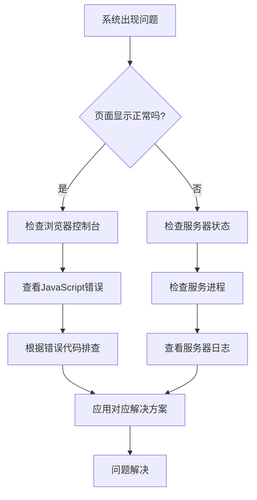

# 🔧 PSCG 故障排除指南

本文档提供了 PSCG 系统常见问题的诊断和解决方法。

## 1. 快速诊断流程



## 2. 前端问题

### 2.1 页面空白/无法加载

#### 症状：
- 页面完全空白
- 浏览器控制台显示 JavaScript 错误
- 网络标签显示 404 或 500 错误

#### 排查步骤：

```bash
# 1. 检查浏览器控制台
# 按 F12 打开开发者工具，查看 Console 标签页

# 2. 检查网络请求
# 在 Network 标签页查看资源加载状态

# 3. 检查Vue是否正常挂载
# 在 Console 中输入：
console.log(window.Vue)
```

#### 常见原因及解决方案：

##### 原因1：JavaScript文件加载失败
```bash
# 检查 dist 目录是否存在
ls -la dist/

# 检查 nginx 配置是否正确
sudo nginx -t
sudo systemctl reload nginx

# 清除浏览器缓存
# Chrome: Ctrl+Shift+Delete
```

##### 原因2：Vue组件错误
```javascript
// 在 main.js 中添加全局错误处理
import { createApp } from 'vue'

const app = createApp(App)

// 全局错误处理器
app.config.errorHandler = (err, vm, info) => {
  console.error('Vue错误:', err)
  console.error('组件:', vm)
  console.error('信息:', info)
  
  // 发送错误到监控系统
  if (typeof sendErrorToMonitoring === 'function') {
    sendErrorToMonitoring(err, { component: vm, info })
  }
}
```

##### 原因3：路由配置问题
```javascript
// 检查 router/index.js
import { createRouter, createWebHistory } from 'vue-router'

const router = createRouter({
  history: createWebHistory(import.meta.env.BASE_URL),
  routes: [
    {
      path: '/',
      name: 'Home',
      component: () => import('@/views/HomeView.vue')
    },
    // 确保所有路由正确配置
  ]
})
```

### 2.2 样式显示异常

#### 症状：
- 页面布局错乱
- 字体、颜色不正确
- 响应式布局失效

#### 排查步骤：
```css
/* 1. 检查CSS加载顺序 */
/* 在浏览器开发者工具的Elements面板检查样式应用 */

/* 2. 检查CSS变量定义 */
:root {
  --primary-color: #409eff;
  /* 确保所有变量正确定义 */
}

/* 3. 检查Element Plus样式 */
/* 确保正确导入Element Plus样式 */
```

#### 解决方案：
```bash
# 1. 清除CSS缓存
# 在构建命令中添加版本号
npm run build -- --mode production

# 2. 检查CSS文件完整性
# 查看dist目录中的CSS文件
cat dist/assets/index.*.css | head -20

# 3. 检查浏览器兼容性
# 确保使用的CSS特性在目标浏览器中支持
```

### 2.3 表单提交问题

#### 症状：
- 表单无法提交
- 验证错误不显示
- 提交后页面无响应

#### 排查步骤：
```javascript
// 1. 检查表单验证
const formRef = ref(null)

const validateForm = async () => {
  try {
    await formRef.value.validate()
    console.log('表单验证通过')
    return true
  } catch (error) {
    console.error('表单验证失败:', error)
    return false
  }
}

// 2. 检查网络请求
axios.interceptors.response.use(
  response => response,
  error => {
    console.error('请求错误:', error)
    return Promise.reject(error)
  }
)
```

## 3. 后端问题

### 3.1 服务器无法启动

#### 症状：
- `npm run server` 命令失败
- 端口被占用
- 依赖包缺失

#### 排查步骤：

```bash
# 1. 检查端口占用
sudo lsof -i :3001
# 或
netstat -tlnp | grep :3001

# 2. 检查依赖安装
npm list --depth=0

# 3. 检查环境变量
echo $NODE_ENV
cat .env

# 4. 查看错误日志
tail -f logs/server.log
```

#### 常见错误及解决：

##### 错误1：端口已被占用
```bash
# 解决方案：更换端口或杀死占用进程
# 方法A：使用不同端口
export PORT=3002
npm run server

# 方法B：杀死占用进程
sudo kill -9 $(lsof -t -i:3001)
```

##### 错误2：数据库连接失败
```bash
# 检查MySQL服务状态
sudo systemctl status mysql

# 检查连接配置
cat config/database.js

# 测试数据库连接
node -e "
const db = require('./services/database.js');
db.testConnection()
  .then(() => console.log('连接成功'))
  .catch(err => console.error('连接失败:', err));
"
```

##### 错误3：缺少依赖包
```bash
# 重新安装依赖
rm -rf node_modules package-lock.json
npm cache clean --force
npm install

# 检查特定包
npm list package-name
```

### 3.2 API 接口返回错误

#### 症状：
- API 返回 4xx 或 5xx 状态码
- 响应数据格式不正确
- 跨域请求失败

#### 排查步骤：

```bash
# 1. 使用 curl 测试 API
curl -X GET "http://localhost:3001/api/health" \
  -H "Content-Type: application/json"

# 2. 检查 API 路由定义
cat routes/users.js

# 3. 查看服务器日志
tail -f logs/api.log
```

#### 常见状态码及解决：

##### 400 Bad Request
```javascript
// 检查请求参数验证
const { body, validationResult } = require('express-validator')

app.post('/api/users', [
  body('email').isEmail().normalizeEmail(),
  body('password').isLength({ min: 6 })
], (req, res) => {
  const errors = validationResult(req)
  if (!errors.isEmpty()) {
    return res.status(400).json({ 
      success: false, 
      errors: errors.array() 
    })
  }
  // 处理逻辑
})
```

##### 401 Unauthorized
```javascript
// 检查认证中间件
const jwt = require('jsonwebtoken')

const authMiddleware = (req, res, next) => {
  const token = req.headers.authorization?.split(' ')[1]
  
  if (!token) {
    return res.status(401).json({
      success: false,
      message: '未提供认证令牌'
    })
  }
  
  try {
    const decoded = jwt.verify(token, process.env.JWT_SECRET)
    req.user = decoded
    next()
  } catch (error) {
    return res.status(401).json({
      success: false,
      message: '无效的认证令牌'
    })
  }
}
```

##### 404 Not Found
```javascript
// 确保路由正确定义
const express = require('express')
const router = express.Router()

router.get('/users/:id', async (req, res) => {
  try {
    const user = await User.findByPk(req.params.id)
    if (!user) {
      return res.status(404).json({
        success: false,
        message: '用户不存在'
      })
    }
    res.json({ success: true, data: user })
  } catch (error) {
    res.status(500).json({ success: false, message: error.message })
  }
})

module.exports = router
```

##### 500 Internal Server Error
```javascript
// 添加全局错误处理
app.use((err, req, res, next) => {
  console.error('服务器错误:', err)
  
  // 记录错误日志
  errorLogger.error({
    message: err.message,
    stack: err.stack,
    url: req.url,
    method: req.method
  })
  
  res.status(500).json({
    success: false,
    message: process.env.NODE_ENV === 'development' 
      ? err.message 
      : '服务器内部错误'
  })
})
```

### 3.3 数据库问题

#### 症状：
- 数据库查询失败
- 连接超时
- 数据不一致

#### 排查步骤：

```bash
# 1. 检查数据库服务
sudo systemctl status mysql

# 2. 检查连接数
mysql -u root -p -e "SHOW PROCESSLIST;"

# 3. 检查磁盘空间
df -h

# 4. 检查慢查询
mysql -u root -p -e "SHOW FULL PROCESSLIST;"
```

#### 解决方案：

##### 连接池配置
```javascript
// services/database.js
const mysql = require('mysql2/promise')

const pool = mysql.createPool({
  host: process.env.DB_HOST,
  port: process.env.DB_PORT,
  user: process.env.DB_USER,
  password: process.env.DB_PASSWORD,
  database: process.env.DB_NAME,
  charset: process.env.DB_CHARSET,
  waitForConnections: true,
  connectionLimit: 10,          // 最大连接数
  queueLimit: 0,               // 无限制排队
  enableKeepAlive: true,       // 保持连接活跃
  keepAliveInitialDelay: 0
})

// 连接测试
async function testConnection() {
  try {
    const connection = await pool.getConnection()
    console.log('数据库连接成功')
    connection.release()
    return true
  } catch (error) {
    console.error('数据库连接失败:', error.message)
    return false
  }
}
```

##### 查询优化
```sql
-- 添加索引
CREATE INDEX idx_user_email ON users(email);
CREATE INDEX idx_answer_user ON answer_records(user_id);

-- 优化查询语句
EXPLAIN SELECT * FROM users WHERE email = 'test@example.com';

-- 定期清理
OPTIMIZE TABLE answer_records;
```

## 4. 性能问题

### 4.1 页面加载缓慢

#### 症状：
- 首屏加载时间长
- 资源文件下载慢
- 接口响应延迟

#### 排查工具：

```bash
# 1. 使用 Lighthouse 分析
# 在 Chrome DevTools 的 Lighthouse 标签页运行

# 2. 检查网络瀑布图
# 在 Network 标签页查看资源加载顺序和时间

# 3. 性能分析
# 使用 Performance 标签页记录和分析
```

#### 优化建议：

##### 前端优化
```javascript
// 1. 代码分割
const HomeView = () => import('@/views/HomeView.vue')

// 2. 图片优化
// 使用 WebP 格式，添加懒加载


// 3. 资源预加载
<link rel="preload" href="critical.css" as="style">
```

##### 后端优化
```javascript
// 1. 添加缓存
const cache = require('memory-cache')

app.get('/api/data', async (req, res) => {
  const cacheKey = 'api_data'
  const cachedData = cache.get(cacheKey)
  
  if (cachedData) {
    return res.json({ success: true, data: cachedData })
  }
  
  const data = await fetchDataFromDatabase()
  cache.put(cacheKey, data, 60000) // 缓存1分钟
  
  res.json({ success: true, data })
})

// 2. 数据库查询优化
async function getUsersWithPagination(page = 1, limit = 20) {
  const offset = (page - 1) * limit
  
  const sql = `
    SELECT id, username, email, role, created_at
    FROM users 
    ORDER BY created_at DESC
    LIMIT ? OFFSET ?
  `
  
  return await db.query(sql, [limit, offset])
}
```

### 4.2 内存泄漏

#### 症状：
- 内存使用量持续增长
- 服务器响应变慢
- 进程频繁重启

#### 排查步骤：

```bash
# 1. 监控内存使用
top -p $(pgrep node)

# 2. 生成堆快照
# 在 Chrome DevTools 的 Memory 标签页

# 3. 使用 clinic.js 分析
npm install -g clinic
clinic doctor -- node server.cjs
```

#### 常见内存泄漏原因：

##### 原因1：事件监听器未清理
```javascript
// 错误示例
class UserManager {
  constructor() {
    this.emitter = new EventEmitter()
  }
  
  setupListeners() {
    this.emitter.on('userUpdate', this.handleUpdate)
  }
  
  // 缺少清理方法
}

// 正确示例
class UserManager {
  constructor() {
    this.emitter = new EventEmitter()
    this.listeners = []
  }
  
  setupListeners() {
    const listener = this.handleUpdate.bind(this)
    this.emitter.on('userUpdate', listener)
    this.listeners.push({ event: 'userUpdate', listener })
  }
  
  cleanup() {
    this.listeners.forEach(({ event, listener }) => {
      this.emitter.off(event, listener)
    })
    this.listeners = []
  }
}
```

##### 原因2：大对象未及时释放
```javascript
// 避免在全局作用域存储大对象
let largeCache = {} // 可能泄漏

// 使用 WeakMap 或定期清理
const weakCache = new WeakMap()

// 或添加清理机制
setInterval(() => {
  if (Object.keys(largeCache).length > 1000) {
    largeCache = {}
  }
}, 60000)
```

## 5. 安全相关问题

### 5.1 认证失败

#### 症状：
- 用户无法登录
- JWT 令牌无效
- 会话过期异常

#### 排查步骤：

```bash
# 1. 检查 JWT 配置
echo $JWT_SECRET

# 2. 验证令牌
node -e "
const jwt = require('jsonwebtoken');
const token = 'your_jwt_token_here';
try {
  const decoded = jwt.verify(token, process.env.JWT_SECRET);
  console.log('令牌有效:', decoded);
} catch (err) {
  console.error('令牌无效:', err.message);
}
"

# 3. 检查会话存储
redis-cli keys "session:*" | wc -l
```

#### 解决方案：

##### JWT 配置验证
```javascript
// config/jwt.js
const jwt = require('jsonwebtoken')

const jwtConfig = {
  secret: process.env.JWT_SECRET || 'default_secret_change_in_production',
  expiresIn: process.env.JWT_EXPIRES_IN || '24h',
  algorithm: 'HS256'
}

// 验证函数
function verifyToken(token) {
  try {
    return jwt.verify(token, jwtConfig.secret, {
      algorithms: [jwtConfig.algorithm]
    })
  } catch (error) {
    console.error('JWT验证失败:', error.message)
    return null
  }
}
```

##### 会话管理优化
```javascript
// middleware/session.js
const session = require('express-session')
const RedisStore = require('connect-redis')(session)

app.use(session({
  store: new RedisStore({
    client: redisClient,
    prefix: 'session:'
  }),
  secret: process.env.SESSION_SECRET,
  resave: false,
  saveUninitialized: false,
  cookie: {
    secure: process.env.NODE_ENV === 'production',
    maxAge: 24 * 60 * 60 * 1000 // 24小时
  }
}))
```

### 5.2 跨域问题（CORS）

#### 症状：
- 浏览器控制台显示 CORS 错误
- 跨域请求被阻止
- 预检请求失败

#### 解决方案：

```javascript
// server.cjs
const cors = require('cors')

// 详细配置CORS
app.use(cors({
  origin: function (origin, callback) {
    // 允许的域名列表
    const allowedOrigins = [
      'http://localhost:5173',
      'http://localhost:3000',
      'https://your-domain.com'
    ]
    
    // 允许所有本地开发环境
    if (!origin || allowedOrigins.includes(origin)) {
      callback(null, true)
    } else {
      callback(new Error('不允许的跨域请求'))
    }
  },
  credentials: true, // 允许发送cookies
  methods: ['GET', 'POST', 'PUT', 'DELETE', 'OPTIONS'],
  allowedHeaders: [
    'Content-Type',
    'Authorization',
    'X-Requested-With',
    'Accept'
  ],
  exposedHeaders: ['Content-Length', 'X-Custom-Header'],
  maxAge: 86400 // 预检请求缓存24小时
}))

// 处理预检请求
app.options('*', cors())
```

## 6. 部署相关问题

### 6.1 Nginx 配置问题

#### 常见配置错误：

```nginx
# 错误配置：缺少 try_files
location / {
    root /var/www/pscg/dist;
    # 缺少 try_files 会导致刷新404
}

# 正确配置
location / {
    root /var/www/pscg/dist;
    try_files $uri $uri/ /index.html;
    expires 1h;
    add_header Cache-Control "public, immutable";
}

# 错误配置：代理配置不正确
location /api {
    proxy_pass http://localhost:3001/; # 注意结尾的斜杠
    # 缺少必要的头信息
}

# 正确配置
location /api {
    proxy_pass http://localhost:3001;
    proxy_http_version 1.1;
    proxy_set_header Upgrade $http_upgrade;
    proxy_set_header Connection 'upgrade';
    proxy_set_header Host $host;
    proxy_cache_bypass $http_upgrade;
    proxy_set_header X-Real-IP $remote_addr;
    proxy_set_header X-Forwarded-For $proxy_add_x_forwarded_for;
    proxy_set_header X-Forwarded-Proto $scheme;
}
```

#### 配置检查命令：
```bash
# 检查语法
sudo nginx -t

# 重新加载配置（不中断服务）
sudo nginx -s reload

# 查看错误日志
sudo tail -f /var/log/nginx/error.log
```

### 6.2 SSL/TLS 证书问题

#### 症状：
- HTTPS 无法访问
- 证书过期
- 浏览器显示不安全警告

#### 解决方案：

```bash
# 1. 检查证书状态
sudo openssl x509 -in /etc/letsencrypt/live/your-domain.com/cert.pem -noout -dates

# 2. 更新证书
sudo certbot renew --dry-run
sudo certbot renew

# 3. 配置自动续期
# 编辑 crontab
sudo crontab -e
# 添加：
0 0 * * * /usr/bin/certbot renew --quiet
```

## 7. 日志分析

### 7.1 日志文件位置

```bash
# 前端开发日志
tail -f node_modules/.vite.log

# 后端服务器日志
tail -f logs/server.log
tail -f logs/api.log
tail -f logs/error.log

# Nginx 日志
tail -f /var/log/nginx/access.log
tail -f /var/log/nginx/error.log

# MySQL 日志
tail -f /var/log/mysql/error.log
```

### 7.2 日志分析工具

```bash
# 实时监控错误
tail -f logs/error.log | grep -E "(ERROR|FAILED|Exception)"

# 统计API请求
cat /var/log/nginx/access.log | \
  awk '{print $7}' | \
  sort | \
  uniq -c | \
  sort -rn | \
  head -20

# 查找慢查询
cat logs/slow-queries.log | \
  awk '{print $1, $2}' | \
  sort | \
  uniq -c | \
  sort -rn
```

## 8. 紧急恢复流程

### 8.1 系统完全无法访问

```bash
# 1. 检查网络连接
ping your-domain.com

# 2. 检查服务器状态
ssh your-server
sudo systemctl status nginx
sudo systemctl status pm2-pscg

# 3. 检查磁盘空间
df -h

# 4. 检查内存使用
free -m

# 5. 重启服务
sudo systemctl restart nginx
pm2 restart all

# 6. 回滚到上一版本（如果有）
cd /var/www/pscg
git log --oneline -5
git checkout <previous_commit_hash>
npm install
npm run build
pm2 restart pscg-server
```

### 8.2 数据库损坏恢复

```bash
# 1. 停止应用
pm2 stop pscg-server

# 2. 备份当前数据库
mysqldump -u root -p pscg_db > backup_$(date +%Y%m%d_%H%M%S).sql

# 3. 修复数据库
mysqlcheck -u root -p --auto-repair pscg_db

# 4. 或使用备份恢复
mysql -u root -p pscg_db < backup_latest.sql

# 5. 重启应用
pm2 start pscg-server
```

## 9. 预防性维护

### 9.1 定期检查清单

```bash
#!/bin/bash
# scripts/health-check.sh

echo "=== 系统健康检查 ==="

# 1. 服务状态
echo "1. 检查服务状态..."
sudo systemctl status nginx | grep -E "(active|failed)"
sudo systemctl status mysql | grep -E "(active|failed)"
pm2 status | grep -E "(online|stopped|errored)"

# 2. 资源使用
echo "2. 检查资源使用..."
df -h | grep -E "(/var|/www)"
free -m | grep "Mem:"

# 3. 日志检查
echo "3. 检查错误日志..."
tail -20 logs/error.log | grep -E "(ERROR|WARN)"

# 4. 证书检查
echo "4. 检查SSL证书..."
sudo certbot certificates | grep -E "(VALID|EXPIRED)"

# 5. 备份检查
echo "5. 检查备份..."
ls -la /var/backups/pscg/ | tail -5

echo "=== 检查完成 ==="
```

### 9.2 自动化监控

```javascript
// scripts/monitor.js
const os = require('os')
const fs = require('fs')
const { exec } = require('child_process')

class SystemMonitor {
  constructor() {
    this.thresholds = {
      cpu: 80,      // CPU使用率阈值
      memory: 85,   // 内存使用率阈值
      disk: 90      // 磁盘使用率阈值
    }
  }

  async checkCPU() {
    const loadavg = os.loadavg()[0] / os.cpus().length
    const cpuUsage = (loadavg * 100).toFixed(2)
    
    if (cpuUsage > this.thresholds.cpu) {
      this.sendAlert(`CPU使用率过高: ${cpuUsage}%`)
    }
    
    return cpuUsage
  }

  async checkMemory() {
    const totalMem = os.totalmem()
    const freeMem = os.freemem()
    const usedMem = totalMem - freeMem
    const memoryUsage = ((usedMem / totalMem) * 100).toFixed(2)
    
    if (memoryUsage > this.thresholds.memory) {
      this.sendAlert(`内存使用率过高: ${memoryUsage}%`)
    }
    
    return memoryUsage
  }

  async checkDisk() {
    return new Promise((resolve, reject) => {
      exec('df -h /var', (error, stdout, stderr) => {
        if (error) {
          reject(error)
          return
        }
        
        const lines = stdout.split('\n')
        if (lines.length > 1) {
          const parts = lines[1].split(/\s+/)
          const usage = parseInt(parts[4])
          
          if (usage > this.thresholds.disk) {
            this.sendAlert(`磁盘使用率过高: ${usage}%`)
          }
          
          resolve(usage)
        } else {
          resolve(0)
        }
      })
    })
  }

  sendAlert(message) {
    console.error(`[警报] ${message}`)
    // 这里可以集成邮件、短信、Slack等通知方式
  }

  async run() {
    console.log('开始系统监控检查...')
    
    const cpu = await this.checkCPU()
    const memory = await this.checkMemory()
    const disk = await this.checkDisk()
    
    console.log(`检查结果: CPU=${cpu}%, 内存=${memory}%, 磁盘=${disk}%`)
    
    return { cpu, memory, disk }
  }
}

// 定时运行监控
const monitor = new SystemMonitor()
setInterval(() => monitor.run(), 300000) // 每5分钟检查一次
```

## 10. 联系支持

### 10.1 问题上报模板

```
# PSCG 问题报告

## 基本信息
- **问题类型**: [前端/后端/数据库/部署]
- **环境**: [开发/测试/生产]
- **重现频率**: [总是/有时/偶尔]

## 问题描述
[详细描述问题现象]

## 重现步骤
1. 
2. 
3. 

## 期望结果
[描述期望的正常行为]

## 实际结果
[描述实际发生的错误行为]

## 附加信息
- **浏览器/版本**: 
- **操作系统**: 
- **网络环境**: 
- **相关截图/日志**: [如有]
```

### 10.2 紧急联系人

| 问题类型 | 联系人 | 联系方式 | 响应时间 |
|----------|--------|----------|----------|
| 前端问题 | 前端开发团队 | team-frontend@example.com | 2小时内 |
| 后端问题 | 后端开发团队 | team-backend@example.com | 1小时内 |
| 数据库问题 | DBA | dba@example.com | 30分钟内 |
| 部署问题 | 运维团队 | ops@example.com | 15分钟内 |
| 紧急故障 | 值班工程师 | oncall@example.com | 5分钟内 |

---

**最后更新**：2025年3月23日  
**文档版本**：v1.0.0  
**适用环境**：开发、测试、生产

> 🚨 **重要提示**：遇到无法解决的问题时，请及时联系相关支持团队，避免自行尝试可能导致系统损坏的操作。